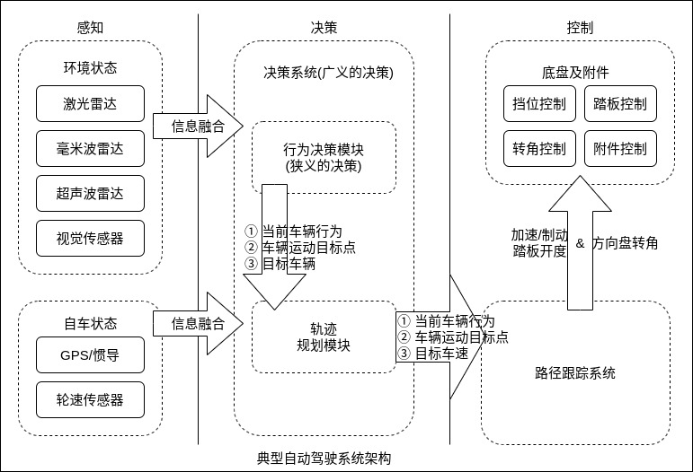

自动驾驶汽车关键技术可大体划分为以下几个部分，其中感知定位、决策规划、控制执行是三大主要技术模块。

1 环境感知技术

环境感知与识别能力是自动驾驶车辆安全、自主、可靠行驶的前提和基础。自动驾驶车辆的环境感知系统利用各种主动、被动传感器获取周围环境的信息，对传感器数据进行处理、融合、理解，实现无人车辆对行驶环境中的障碍物、车道线以及红绿灯等的检测，给车辆的自主导航和路径规划提供依据。

环境感知与识别系统一般包括`传感器、传感器数据处理以及多传感器数据融合三个子系统`。传感器系统通常采用摄像机、激光雷达、超声传感器、毫米波雷达、全球导航卫星系统(GNSS)、里程计以及磁罗盘等多种车载传感器来感知环境。视觉传感器包括单目和多目彩色摄像机，距离探测设备包括声呐、毫米波雷达和激光雷达等。其中，激光雷达和毫米波雷达能够测得目标的相对速度，获得三维点云数据；里程计和惯性传感器能够估计车辆的运动。

2 决策规划技术

自动驾驶作为一个复杂的软硬件综合系统，其安全可靠运行需要车载硬件、传感器集成、感知、决策以及控制等多个模块的协同配合工作。环境感知和决策规划的紧密配合非常重要。这里的决策规划在广义上可以划分成无人车路由寻径、行为决策、动作规划等几个部分。

路由寻径的作用是实现无人车软件系统内部的导航功能，即在宏观层面上指导无人车软件系统的规划控制模块按照什么样的道路行驶，从而实现从起始地到目地的。在细节上紧密依赖专门为无人车导航绘制的高精地图，和传统的导航有本质不同。

路由寻径模块产生的路径信息，直接被下游的行为决策模块所使用。行为决策接收路由寻径的结果，同时也接收感知预测和地图信息。综合这些输入信息，行为决策模块在宏观上决定了无人车如何行驶。这些行为层面的决策包括在道路上的正常跟车，在遇到交通信号灯和行人时的等待避让，以及在路口和其他车辆的交互通过等。

无人车的动作规划问题是整个机器人动作规划领域里相对简单的一个问题，因为车辆的轨迹附于一个二维平面，因此轨迹规划这一层面需要解决的问题往往可以非常好地抽象成一个在二维平面上的时空曲线优化问题。

3 控制执行技术

架构最下层的模块是控制执行模块。这是一个直接和无人车底层控制接口 CAN BUS 对接的模块，其核心任务是接收上层动作规划模块的输出轨迹点，通过一系列结合车身属性和外界物理因素的动力学计算，转换成对车辆加速、制动的控制、以及方向盘信号，尽可能地控制车辆去执行这些轨迹点。控制执行模块主要涉及对车辆自身控制，以及和外界物理环境交互的建模。

自动驾驶中的控制执行依靠线控技术。从概念上说，汽车线控技术是将驾驶员的操纵动作经过传感器变成电信号，通过电缆直接传输到执行机构的一种控制系统。汽车的线控系统主要包含线控转向系统、线控加速系统、线控制动系统、线控悬架系统、线控换挡系统以及线控增压系统等。通过分布在汽车各处的传感器实时获取驾驶员的操作意图和汽车过程中的各种参数信息，传递给控制器；控制器对这些信息进行分析和处理，得到合适的控制参数并传递给各个执行机构，从而实现对汽车控制，提高车辆的转向性、动力性、制动性和平顺性。

4 V2X 通信技术

包括车辆专用通信系统、实现车间信息共享与协同控制的通信保障机制、移动自组织网络技术、多模式通信融合技术等。

5 云平台与大数据技术

包括智能网联汽车云平台架构与数据交互标准、云操作系统、数据高效存储和检索技术、大数据的关联分析和深度挖掘技术等。

6 信息安全技术

包括汽车信息安全建模技术，数据存储、存储与应用三维度安全体系，汽车信息安全测试方法，信息安全漏洞应急响应机制等。

7 高精度地图与高精度定位技术

包括高精地图数据模型与采集式样、交换格式和物理存储的标准化技术，基于北斗地基增强的高精度定位技术，多源辅助定位技术等。

8 标准法规

包括 ICV 整体标准体系，以及涉及汽车、交通、通信等各领域的关键技术标准。

9 测试评价

包括 ICV 测试评价与测试环境建设。
