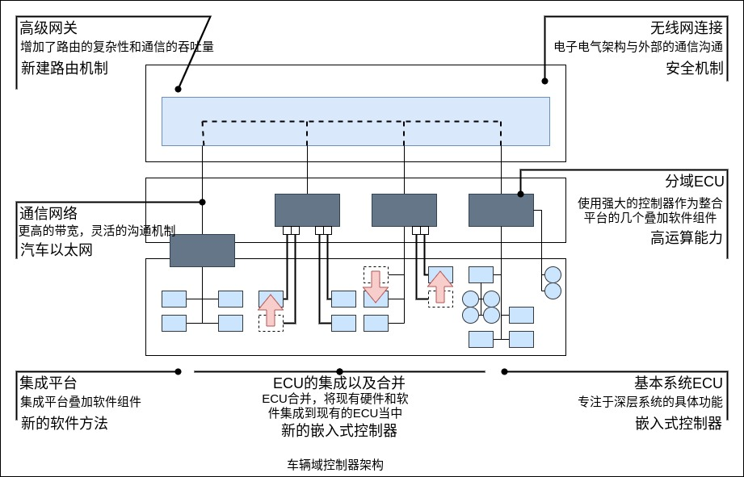

自动驾驶汽车利用计算机代替人类实现驾驶功能，这就需要在有人驾驶汽车的基础上增加感知定位系统、计算平台、控制执行系统等一系列能够实现车辆环境感知、决策与驾驶动作执行的系统。在车辆内部，为了辅助各系统的正常运行，通信总结、控制单元以及整车的电子电气架构都要进行相应的改进甚至重新设计。自动驾驶的域控制器，需具备多传感器融合、定位、路径规划、决策控制、无线通信、高速通信等能力。通常需要外接多个摄像头、毫米波雷达、激光雷达以及 IMU 等设备，实现功能包含图像识别、数据处理等。由于要完成大量运算，域控制器一般都要匹配一个核心运算力强的处理器，能够提供自动驾驶不同级别算力的支持。

车辆域控制器架构如下。

当前汽车已经实现了高级辅助驾驶系统(ADAS)，包括辅助泊车、自动制动、行人检测和防撞等功能。为了使汽车快速应答并实时产生决策，ADAS 应用程序必须快速捕获、处理来自多个摄像头和传感器的输入。车内摄像系统的数据速率通常比较高。以全景环视系统为例，每个摄像头的视频流通常为 1280像素 × 800像素，帧率为 30f/s。信息娱乐系统也依赖于摄像头，其支持的分辨率越来越高，以处理音频和视频数据。安全和信息娱乐系统相结合，使得未来汽车上可能安装十几个摄像头，多个超高清显示屏，以及支持所有数据传输的串行链路。当然，V2X 通信也相当重要，与 ADAS 和信息娱乐系统一样，V2V、V2X 和传感器融合系统全部要求宽带和数据完整性，从而实现汽车间以及与道路基础设施间共享数据，并作出相应决策。

自动驾驶系统主要包含三个部分: 感知、决策、控制。

- 感知层: 依赖大量传感器的数据，分为车辆运动、环境感知、驾驶员检测三大类。
- 车辆运动传感器: 速度和角度传感器提供车辆线控系统的相关横向和纵向信息。"惯性导航+全球定位系统=组合导航"，提供全姿态信息参数和高精度定位信息。
- 环境感知传感器: 主要依靠激光雷达、摄像头、毫米波雷达的数据融合提供给计算单元进行算法处理。V2X 就是与周围一切能与车辆发生关系的事物进行通信。
- 驾驶员监测传感器: 分为基于摄像头的非接触式和基于生物电传感器的接触式两种。通过方向盘和仪表内集成的传感器，将驾驶员的面部细节以及心脏、脑部等部分的数据进行收集，再根据这些部分数据变化，判断驾驶员是否处于走神和疲劳驾驶状态。
- 计算单元部分: 各类传感器采集的数据统一到计算单元处理，为了保证自动驾驶的实时性要求，软件响应最大延迟必须在可接受的范围内。目前主流的解决方案分别基于 GPU、FPGA、ASIC 等。
- 车辆控制: 自动驾驶需要用电信号控制车辆的转向、制动、油门系统，其中涉及车辆底盘的线控改装，目前在具备自适应巡航、紧急制动、自动泊车功能的车上可以直接借用原车的系统，通过 CAN 总线控制而不需要过度改装。
- HMI 系统: 车机、仪表、HUD 等车内 HMI 的设计的主要目的是与车内乘员实现交互，例如导航、接管提醒、语音交互等。并且能通过声音、图像、振动提醒司机注意安全，有效减少司机困倦、分心的状态。
