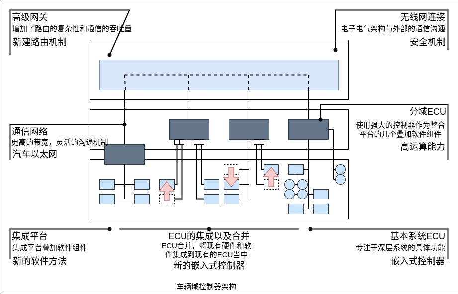

控制平台由电子控制单元(ECU)与通信总线两大部分组成。ECU 主要实现控制算法，通信总线主要实现 ECU 及机械部件间的通信功能。

控制平台是无人车的核心部件，集成着车辆的各种控制系统，主要包括汽车防抱死制动系统(ABS)、汽车驱动防滑系统(ASR)、汽车电子稳定程序(ESP)、电子感应制动控制系统(SBC)、电子制动力分配(EBD)、辅助制动系统(BAS)、安全气囊(SRC)和汽车雷达防碰撞系统、电控自动变速器(EAT)、无级变速器(CVT)、巡航控制系统(CCS)、电子控制悬架(ECS)、电控动力转向系统(EPS)等。

### 电子控制单元

电子控制单元(Electronic Control Unit,ECU)又称"车载计算机"，是汽车专用微机控制器。发动机工作时，ECU 采集各传感器的信号进行运算，并将运算结果转变为控制信号，控制被控对象的工作。在发动机工作时，不断地与采集来的各传感器的信号进行比较和计算，再利用比较和计算后的结果完成对发动机的点火、怠速、废气再循环等多项参数的控制。它还有故障自诊断和保护功能。存储器也会不停地记录行驶中的数据，成为 ECU 的学习程序，为适应驾驶习惯提供最佳的控制状态，这称为自适应程序。在高级轿车上，有时配置多个 ECU，如防抱死控制系统、四轮驱动系统、电控自动变速器、主动悬架系统、安全气囊系统、多向可调电控座椅等都有各自的 ECU 。

CPU 是 ECU 中的核心部分，它具有运算与控制的功能。在发动机运行时，它采集各传感器的信号进行运算，并将运算的结果转变为控制信号，控制被控对象的工作。它还实现对存储器(ROM、RAM)、输入/输出接口(I/O)和其他外部电路的控制。

### 域控制器

自动驾驶的域控制器，需具备多传感器融合、定位、路径规划、决策控制、无线通信、高速通信等能力。通常需要外接多个摄像头、毫米波雷达、激光雷达以及 IMU 等设备，实现功能包含图像识别、数据处理等。由于要完成大量运算，域控制器一般都要匹配一个核心运算力强的处理器，能够提供自动驾驶不同级别算力的支持。

应用域控制器可实现模块化开发，将功能划分为单独的域有众多优势，这有助于强调各个子系统的功能安全和网络安全需求，简化自动化算法的开发和部署，方便在各个子系统中扩展功能。

车辆域控制器架构如下。

