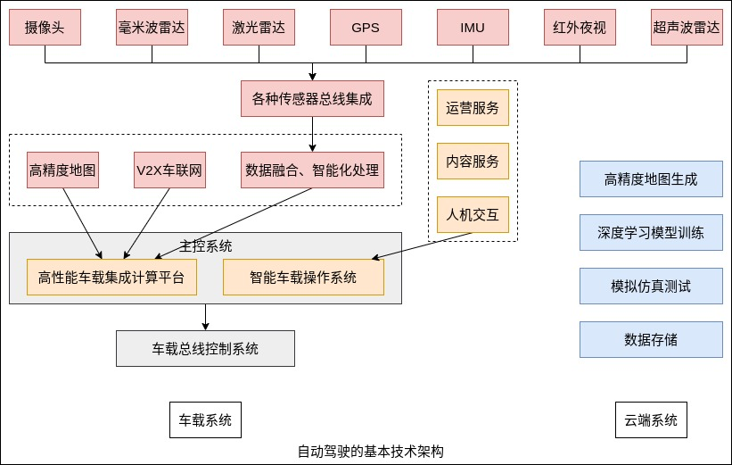

### 模块层级

自动驾驶汽车关键技术可大体划分为以下几个部分，其中感知定位、决策规划、控制执行是三大主要技术模块。

1 环境感知技术

环境感知与识别能力是自动驾驶车辆安全、自主、可靠行驶的前提和基础。自动驾驶车辆的环境感知系统利用各种主动、被动传感器获取周围环境的信息，对传感器数据进行处理、融合、理解，实现无人车辆对行驶环境中的障碍物、车道线以及红绿灯等的检测，给车辆的自主导航和路径规划提供依据。

环境感知与识别系统一般包括`传感器、传感器数据处理以及多传感器数据融合三个子系统`。传感器系统通常采用摄像头、激光雷达、超声传感器、毫米波雷达、全球导航卫星系统(GNSS)、里程计以及IMU(惯性测量单元)等多种车载传感器来感知环境。视觉传感器包括单目和多目彩色摄像机，距离探测设备包括声呐、毫米波雷达和激光雷达等。其中，激光雷达和毫米波雷达能够测得目标的相对速度，获得三维点云数据；里程计和惯性传感器能够估计车辆的运动。

2 决策规划技术

自动驾驶作为一个复杂的软硬件综合系统，其安全可靠运行需要车载硬件、传感器集成、感知、决策以及控制等多个模块的协同配合工作。环境感知和决策规划的紧密配合非常重要。

决策层具体来说分为两步: 第一步是认知理解，根据感知层收集的信息，对车辆自身的精确定位，对车辆周围的环境的准确判断；第二步是决策规划，包含对接下来可能发生情况的准确预测，对下一步行动的准确判断和规划，选择合理的路径达到目标。通过这两步使无人驾驶车产生安全、合理的驾驶行为，指导运动控制系统对车辆进行控制。

3 控制执行技术

架构最下层的模块是控制执行模块。这是一个直接和无人车底层控制接口 CAN BUS 对接的模块，其核心任务是接收上层动作规划模块的输出轨迹点，通过一系列结合车身属性和外界物理因素的动力学计算，转换成对车辆加速、制动的控制、以及方向盘信号，尽可能地控制车辆去执行这些轨迹点。控制执行模块主要涉及对车辆自身控制，以及和外界物理环境交互的建模。

控制层离不开和车载控制系统的深度集成，真正的自动驾驶必须将决策控制信息与车辆底层控制系统深度集成，通过线控技术完成执行机构的电控化，达到电子制动、电子驱动和电子转向，并控制车辆响应，保证控制精度，对目标车速、路径等进行跟踪。

自动驾驶中的控制执行依靠线控技术。从概念上说，汽车线控技术是将驾驶员的操纵动作经过传感器变成电信号，通过电缆直接传输到执行机构的一种控制系统。汽车的线控系统主要包含线控转向系统、线控加速系统、线控制动系统、线控悬架系统、线控换挡系统以及线控增压系统等。通过分布在汽车各处的传感器实时获取驾驶员的操作意图和汽车过程中的各种参数信息，传递给控制器；控制器对这些信息进行分析和处理，得到合适的控制参数并传递给各个执行机构，从而实现对汽车控制，提高车辆的转向性、动力性、制动性和平顺性。

4 V2X 通信技术

包括车辆专用通信系统、实现车间信息共享与协同控制的通信保障机制、移动自组织网络技术、多模式通信融合技术等。

5 云平台与大数据技术

包括智能网联汽车云平台架构与数据交互标准、云操作系统、数据高效存储和检索技术、大数据的关联分析和深度挖掘技术等。

6 信息安全技术

包括汽车信息安全建模技术，数据存储、存储与应用三维度安全体系，汽车信息安全测试方法，信息安全漏洞应急响应机制等。

7 高精度地图与高精度定位技术

包括高精地图数据模型与采集式样、交换格式和物理存储的标准化技术，基于北斗地基增强的高精度定位技术，多源辅助定位技术等。

8 标准法规

包括 ICV 整体标准体系，以及涉及汽车、交通、通信等各领域的关键技术标准。

9 测试评价

包括 ICV 测试评价与测试环境建设。

### 技术架构

自动驾驶的基本技术架构基本分为车载系统和云端系统两部分。如下图所示。

1 车载系统

感知层通过各种类型的传感器采集、接收的数据，通过总线进行集成，再通过数据的融合和智能化处理，输出自动驾驶所需的环境感知信息。车载传感器的优化配置，可以在保证精度的安全性的基础上，降低整体成本。

主控系统由硬件部分高性能车载集成计算平台和软件部分智能车载操作系统组成。计算平台融合了传感器、高精度地较长、V2X 的感知信息进行认知和决策计算，硬件处理器可以有 GPU、FPGA、ASIC 等多种选择。智能车载操作系统融合了车内人机交互、运营服务商、内容服务商的数据，为乘客提供个性化服务，真正把智能车变成下一个互联网入口，目前的主流操作系统包括 Android、Linux、Windows、QNX 等。

最后，主控系统的信息进入车载总线控制系统，完成执行动作。

2 云端系统

自动驾驶车辆是一个移动系统，需要云平台来提供支持。云端主要完成 4 个功能。
1) 数据存储: 智能车路测中实采的数据量非常大，需要传输到云端进行分布式存储。
2) 模拟仿真测试: 开发的新算法在部署到车上之前会在云端的模拟器上进行测试。
3) 高精度地图生成: 地图的生成采用众包形式，把每辆在路上行驶的智能车实时采集到的激光点云或视觉数据上传至云端，实现高精地图的完善和更新。
4) 深度学习模型训练: 自动驾驶的决策层使用了多种不同的深度学习模型，对于没有出现过的情况无法处理，因此需要持续不断地通过新数据进行模型训练，来提升算法的处理能力。由于训练的数据量非常大，所以要在云端完成。
