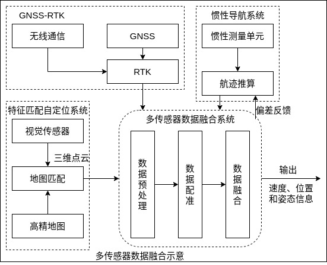

自动驾驶汽车能够持续安全可靠运行的一个关键前提是车辆的定位系统必须实时稳定地输出足够高精度的位置和与位置相关的信息，这些信息包括车辆的经度、纬度、航向角、速度、加速度、俯仰角、更新频率等。定位信息更新频率 >= 100Hz，定位精度须 <= 25cm 才能保证车辆行驶安全。

目前的高精定位技术路线主要有三种: 基于卫星定位系统和惯导系统的组合定位技术，基于激光雷达点云和高精地图的匹配定位技术，以及基于计算机视觉里程算法的定位技术。激光雷达在车辆行驶过程中不断收集点云来动态了解周围环境，通过这些环境信息与高精地图进行比对匹配确定车辆位置。基于视觉的定位算法主要有两大类: 基于地标拓扑的算法和基于几何的视觉里程算法。但是摄像头成像质量对光线相当敏感，在不同的光线环境下，同样的场景可能不被识别，导致算法失效。因此不建议自动驾驶场景中独立依赖视觉里程算法进行车辆定位。

### 卫星定位技术

在任何驾驶条件下，自动驾驶车辆均依赖于两种信息: 汽车位置和汽车行驶的速度，收集这些信息需要整合多种复杂技术，其中全球导航卫星系统(GNSS)起主要作用。当自动驾驶汽车拥有高精度的位置信息之后，就可以跟高精地图进行匹配，从而形成良好的导航功能。GNSS 系统也能为车载传感器的时间同步或者导航提供最基础的时空信息。

GPS 能提供全球性、全天候的定位、授时信息，并且有长期精度高、误差不随时间累积的优点。但在复杂的动态环境，尤其是在大城市中，GPS 信号容易受到高楼、高架桥、隧道等建筑物的遮挡和严重的多路径效应干扰，导致 GPS 定位信息产生米级甚至更大量级的误差。另外 GPS 的更新频率低(10Hz)，在车辆快速行驶时很难给出精准的实时定位。单纯依赖 GPS 的导航很有可能导致交通事故。因此，GPS 通常辅助以惯性传感器(IMU)用来增强定位的精度。IMU 是测量加速度与角速度的高频(1kHz)传感器，惯性导航的优点是不依赖于外界信息、抗干扰、数据更新频率高、短期精度高、能输出姿态信息等；但是，纯惯性导航的误差会随着导航时间的延长而迅速累积。

工作原理: GNSS 定位主要解决两个问题，一是观测瞬间卫星的空间位置，二是测量站点卫星之间的距离。空间位置即 GNSS 卫星在某坐标系中的坐标，为此首先要建立适当的坐标系来表征卫星的参考位置，而坐标又往往与时间联系在一起，因此，定位是基于坐标系统和时间系统来进行的。利用基本三角定位原理，GNSS 接收装置通过测量无线电信号的传输时间来测量距离。由每颗卫星的所在位置，和测量得到的每颗卫星与接收装置的距离，便可以算出接收器所在位置的三维坐标值。使用者至少需收到 3 颗卫星的信号才可确定自身的位置。实际使用中 GNSS 接收装置都是利用 4 个以上的卫星信号来确定使用者所在位置及高度。

卫星导航系统的误差从来源上可以分为 4 类: 与信号传播有关的误差，与卫星有关的误差，与接收机有关的误差以及地球潮汐、负荷潮等造成的其他误差。

### 差分定位系统

减少甚至消除卫星定位的误差是提高定位精度的措施之一，而差分 GNSS(Differential GNSS,DGNSS)可有效地利用已知位置的基准站或流动站将公共误差估算出来，通过相关的补偿算法完成精确定位，消除公共误差，从而提高定位精度。

根据差分校正的目标参量的不同，差分 GNSS 主要分为位置差分、伪距差分和载波相位差分。位置差分技术与伪距差分技术都能满足基本定位导航等的精度需求，但是在车联网和自动驾驶领域还远远不能满足需求，从而促使发展出更加精准的 GNSS 差分技术，即载波相位差分技术，也称为实时动态差分技术(Real Time Kinematic,RTK)。RTK 是一种利用接收机实时观测卫星信号载波相位的技术，将数据通信技术与卫星定位技术相结合，采用实时解算和数据处理的方式，能够实现实时地为流动站提供在指定坐标系中的三维坐标，在极短的时间内实现厘米级高精度的定位。

传统的 RTK 定位技术虽然可以满足很多应用的要求，但流动站与基准站的距离不能太长，当距离大于 50km 时，现有 RTK 单历元解一般只能达到分米级的定位精度。网络 RTK 也称多基准站 RTK，是近年来基于传统 RTK 技术和差分 GNSS 技术等发展起来的一种实时动态定位新技术。与传统 RTK 相比，网络 RTK 扩大了覆盖范围，降低了作业成本，提高了定位精度，减少了用户定位的初始化时间。

### 惯性导航定位

卫星导航作为定位方式有更新频率低的问题，只有 10Hz 左右，无法满足自动驾驶汽车的要求。因此，必须借助其他传感器和定位手段来共同增强定位的精度，惯性导航系统是其中最重要的部分。建立在牛顿定律基础上的惯性导航系统(Inertial Navigation System,INS)(简称惯导系统)不与外界发生任何光电联系，仅靠系统本身就能对车辆进行连续的三维定位和三维定向。

惯性导航系统是一种不依赖于外部信息、也不向外部辐射能量的自主式导航系统。其主要由 3 个模块组成: 惯性测量单元(Inertial Measurement Unit,IMU)、信号预处理单元和机载力学编排模块。如下图所示。

一个 IMU 包括 3 个相互正交的单轴的加速度计(Accelerometer)和 3 个相互正交的单轴的陀螺仪(Gyroscopes)。信号预处理部分对 IMU 输出信号进行信号调理、误差补偿，并检查输出量范围等，以使惯性传感器正常工作。

惯性导航系统以陀螺仪和加速度计为敏感元件，应用航迹推算法提供位置、速度和姿态等信息。汽车行驶数据的采集由以陀螺仪和加速度计组成的惯性测量单元来完成。

### 多传感器融合定位

GNSS 是一个应用广泛、适用范围广、定位精度高的系统，但是当它应用于无人车辆时，其更新频率过低的缺点便相对突出，仅有 10Hz 左右的更新频率不足以满足无人驾驶系统对定时定位的要求。由于误差累积的原因，INS 惯性导航系统的准确度随时间和行驶距离的增加而降低，因此也无法完整保证定位的准确性；不过，它的更新频率较高，可以达到 200Hz 以上，满足自动驾驶系统的需求。通过适当的方法将 GNSS 与 INS 的数据进行融合，可以为车辆定位提供既准确又足够实时的位置信息。

GNSS 主要依赖卫星定位，但其信号容易受到干扰，如玻璃幕墙会不断反射 GNSS 信号，所以 GNSS 定位精度大概在米级别。为了提高其精度，可以通过建立 RTK 基站，将两者信号做差分，这样环境因素就可以忽略不计，从而提高 GNSS 的精度到 10cm 左右。但单纯依赖 RTK 仍然不够，因为只有车辆靠近 RTK 基站范围内 16.09km(10mile)左右才能发挥其作用，且 GNSS 和 RTK 的计算结果是实时的，存在可跳变的因素，此时需要 IMU(惯性导航)发挥关键作用。IMU 可以根据车辆的位置和各种速度的叠加做积分，从而预算出车辆的行径位置，提高车辆定位的精确度。当遇到桥洞或隧道时，GNSS 的信号也会变差，这时候需要用点云或视觉定位。通过配合点云地图和实时数据的采集来分析车辆位置，再加上摄像头为主的视觉定位，以及 GNSS+RTK 和 IMU 的配合，车辆定位就可以达到厘米级的精度。

多传感器信息融合的目标是利用各种传感器分离观测信息，对数据进行多级别、多方位和多层次的处理，产生新的有意义的信息。它的最终目的是利用多个传感器共同或联合操作的优势，来提高整个传感器系统的有效性。

多传感器融合的数据主要包括 GNSS-RTK、惯性导航系统和特征匹配自定位系统的输入数据。对这些数据进行预处理、数据配准和数据融合等处理后，输出车辆自身的速度、位置和姿态信息。如下图所示。

数据预处理可以考虑为传感器初始化及校准，传感器初始化即相对于系统坐标独立地校准每一个传感器。一旦完成了传感器初始化，就可以利用共同的目标开始相对的数据配准过程。所谓数据配准，就是把来自一个或多个传感器的观测或点迹与已知或已经确认的事件归并到一起，保证每个事件集合所包含的观测来自同一个实体的概率较大。具体地说，就是要把每批目标的点迹与数据库中各自的航迹配对。空间内存在较多目标，若将其配错将产生错误。在传感器配准过程中，收集足够的数据点来计算系统偏差，计算得到的系统偏差用以对调整后得到的传感器数据作进一步的处理。

传感器的配准是指多传感器数据"无误差"转换时所需要的处理过程，一般主要包括时间配准和空间配准两个方面。所谓时间配准，就是将关于同一个目标的各传感器不同步的测量信息同步到同一时刻。由于各传感器(系统)和融合处理中心之间传送信息所需的时间也各不相同，因此，各传感器发送数据有可能存在时间差，所以融合处理前须将不同步的信息配准到相同的时刻。所谓空间配准，又称为传感器配准，就是借助于多传感器对空间共同目标的测量，对传感器的偏差进行估计和补偿。对于同一系统内采用不同坐标系的各传感器的测量，定位时必须将它们转换成同一坐标系中的数据。对于多个不同子系统，各子系统采用的坐标系是不同的，所以在融合处理各子系统的信息前，也应将它们转换到同一测量坐标系中，而处理后还须将转换成各子系统坐标系的数据后，再传送给各个子系统。

数据融合需要借助融合算法。通过基于卡尔曼滤波的最优估计理论的数据处理方法为组合惯导系统提供了理论基础并被广泛应用。它可以融合 GPS 和 IMU 数据，它们组合的优势有以下几点。
- 系统精度的提高。利用 GPS 的长期稳定性弥补 IMU 误差随时间累积的缺点。GPS/IMU 组合后的导航误差要比单独的 GPS 或单独的惯导系统可能达到的误差都小。
- 系统抗干扰能力的增强。利用 IMU 的短期高精度弥补 GPS 系统易受干扰、信号易失锁等缺点，同时借助 IMU 的姿态信息、角速度信息可进一步提高 GPS 系统快速捕获或重新锁定卫星信号的能力。
- 导航信息的补全。GPS/IMU 组合系统与单纯 GPS 相比，除了可以提供载体运动的三维位置和速度信息外，还可提供加速度、姿态和航向信息；GPS/IMU 组合系统可提供 100Hz 甚至更高的数据更新率。

滤波器运行时主要分预测和更新两个阶段。预测阶段，在得到新 GPS 数据前，通过积分惯性传感器的数据来预测车辆的当前位置；更新阶段，当接收到新的比较精准的 GPS 数据时，使用新的 GPS 数据对当前的位置进行预测更新。通过不断地执行这两个步骤来实现对自动驾驶汽车的准确实时定位。
