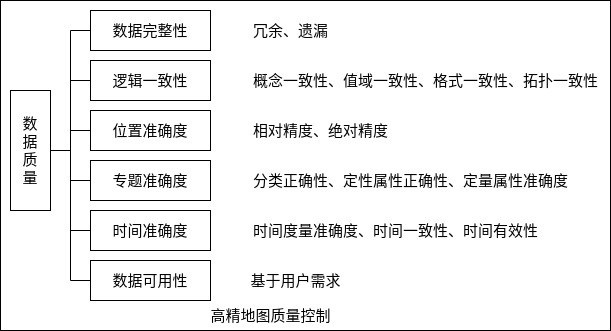

高精地图也可称为自动驾驶地图。与普通地图不同，高精地图主要服务于自动驾驶车辆，是自动驾驶的核心基础模块。如果没有高精地图，高可靠性的 L3 或 L4 自动驾驶无法落地。高精地图的作用首先是静态的感知，把人类对于世界的感知和理解赋予自动驾驶系统；其次，它可以弥补系统性缺陷，扩展传感器检测边界，解决系统性能问题。

此外，除了高精地图，还有 HAD Map(Highly Automated Driving Map)，即高度自动驾驶地图。高精地图最显著的特点是其表征路由特征的精准全面性，而高度自动地图要求有更高的实时性。因此，HAD Map 在高精地图的基础上又有了更高的水平。

高精地图的采集依赖传感器来完成，主要包括 GPS、惯性导航 IMU、轮测距器、激光雷达等。

高精地图制作流程主要包括以下内容。首先 IMU 及轮测距器可以高频率地给出当前无人车的位置预测，但由于其精确度原因，位置可能会有一定程度偏差。为了纠正这些偏差，可以使用传感器融合技术，结合 GPS 与激光雷达(LiDAR)的数据算出当前无人车的准确位置。然后根据当前的准确位置与激光雷达的扫描数据，把新数据加入地图中。

### 高精地图生产流程

高精地图数据生产包括外业采集、云端自动化处理、数据编辑与质量控制、数据编译与引擎等步骤。外业采集，通过搭载 GNSS、IMU、LiDAR、摄像头等传感器的专业采集车队，外业实地采集车道线、路沿护栏、交通标牌等信息。通过点云融合、点云识别和图像识别等 AI 技术，在云端实现自动化处理。利用高精地图编辑工具、生产管理系统，进行地图编辑。基于 ISO 19157/19158 等质量标准，构建全流程数据质量保障体系。

高精地图需要获取的地物主要包括车道线、道路交通设施(人行横道、转向标志、交通设施等)、车道拓扑网络数据以及其他地物等。根据数据采集方式的不同，高精地图生产方式有所差异。基于移动测绘车采集的数据，前期需要进行点云数据的分区、去噪、拼接等预处理，进而进行矢量化、几何调整、增加属性和拓扑结构建立等加工处理；无人机航测高精地图生产，基于校正、拼接等预处理得到高精地图正射影像图，采用自动与人工相结合的方式进行数据矢量化加工处理，1:500地形图测绘基于外业采集的数据进行内业地图编绘，通过格式转换、地物分类等进行加工处理。三维高精地图生产过程均需要通过多级质检保证最终成果数据的可靠性。移动测绘车生产方式目前正在形成一种"专业采集+众包维护"的地图动态更新方式，无人机航测数据更新则需要重新进行航测，1:500地形图测绘采用部分补测的方式实现数据更新。

### 高精地图采集平台

高精地图的采集需要专用的采集车携带激光雷达、摄像机、GNSS、IMU 等设备进行。激光雷达用来采集点云数据，摄像机采集道路实景图像，GNSS 与 IMU 用来定位。下面介绍采集车用到的主要设备。

惯性测量单元(IMU): 一般使用 6 轴运动处理组件，包含了 3 轴加速度传感器和 3 轴陀螺仪。加速度传感器是力传感器，用来检查上下左右前后哪几个面各受了多少力(包括重力)，然后计算每个自由度上的加速度。陀螺仪是角速度检测仪，检测每个自由度上的角加速度。

轮测距器(Wheel Odometer): 可以通过轮测距器推算出无人车的位置。汽车的前轮通常安装了轮测距器，分别会记录左轮与右轮的总转数。通过分析每个时间段里左右轮的转数，可以推算出车辆向前走了多远，向左或向右转了多少角度等。行驶条件的差异，导致随着时间推进，测量偏差会越来越大。

GNSS: 确定 4 颗或更多卫星的位置，并计算出它与每颗卫星之间的距离，然后用这些信息通过三维空间的三边测量法进行定位。要使用距离信息进行定位，接收机还必须知道卫星的确切位置。GNSS 接收机储存有星历，其作用是告诉接收机每颗卫星在各个时刻的位置。GNSS 误差不会累积，但测量精度有限。

激光雷达(LiDAR): 采集点云信息，进行周围环境的感知与建模。激光雷达采集到的信息是构建高精地图的主要部分。

### 高精地图的质量要求

高精地图的数据质量主要分为数据完整性、数据可用性、位置准确度、专题准确度、时间准确度、逻辑一致性等 6 个方面目标。如下图所示。

高精地图的质量标准可分为属性标准和几何标准两个方面。具体而言，属性标准包括属性要素、FPR 标准、FNR 标准。其中属性要素有车道类型等车道信息，路沿、护栏等道路信息，限速、限行等交通信息；几何标准包括绝对精度和相对精度，高精地图绝对精度在 1m 左右，不超过 2m，相对精度在 20cm 左右，不超过 30cm 。

- FNR(遗漏率) = 遗漏量 / 真值
- FPR(冗余率) = 冗余量 / 真值
