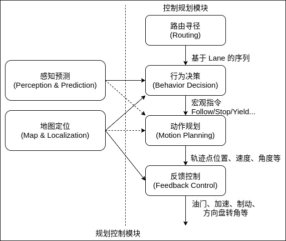

自动驾驶的行为决策系统主要有基于规则和基于学习算法两大类。基于规则的行为决策，即将自动驾驶车辆的行为进行划分，根据行驶规则、知识、经验、交通法规等建立行为规则库，根据不同的环境信息划分车辆状态，按照规则逻辑确定车辆行为的方法，其代表方法为有限状态机法。基于学习算法的行为决策，即通过对环境样本进行自主学习，由数据驱动建立行为规则库，利用不同的学习方法与网络结构，根据不同的环境信息直接进行行为匹配，输出决策行为的方法，以深度学习的相关方法及决策树等各类机器学习方法为代表。

自动驾驶汽车作为一个复杂的软硬件结合系统，其安全可靠运行需要车载硬件、传感器集成、感知、预测以及控制规划等多个模块紧密协同配合工作。其中最关键的部分是感知预测和控制规划的紧密结合。规划控制广义上可以分为路由寻径(Routing)、行为决策(Behavior Decision)、动作规划(Motion Planning)以及反馈控制(Feedback Control)几个部分。如下图所示。

路由寻径、行为决策、动作规划三个部分又可统称为路径规划。路径规划部分承接上层感知预测结果，从功能上可分为全局路径规划和局部路径规划。

### 路由寻径

全局路径规划对应的是路由寻径部分，其作用可以简单理解为实现自动驾驶汽车软件系统内部的导航功能，即从宏观层面上指导自动驾驶汽车软件系统的规划控制模块按照什么样的道路行驶，从而实现从起始点到目的地点。

作为整体无人车控制规划系统的最上游模块，路由寻径模块的输出严格依赖无人车高精地图(HD-Map)的绘制。在高精地图绘制的路网(Road Graph)的道路(Lane)划分的基础上，以及在一定的最优解策略定义下，路由寻径模块需要解决的问题是计算出一个从起点到终点的最佳道路行驶序列。路由寻径问题可以利用常见的 A*算法 或者 Dijkstra 算法来实现。

### 行为决策

路由寻径模块产生的路径信息，直接被中游的行为决策模块所使用。行为决策模块接收路由寻径的结果，同时也接收感知预测和地图信息。综合这些输入信息，行为决策模块在宏观上决定了自动驾驶汽车如何行驶。这些行为层面的决策包括在道路上的正常跟车、在遇到交通信号灯和行人时的等待和避让，以及在路口和其他车辆的交互通过等。行为决策和动作规划需要紧密协调配合，在设计实现两个模块时的一个重要的基本准则是，行为决策模块的输出需要和下游的动作规划模块的逻辑配合一致。

行为决策层面汇集了所有重要的车辆周边信息，不仅包括了自动驾驶汽车本身的当前位置、速度、朝向以及所处车道，还收集了自动驾驶汽车一定距离以内所有重要的感知相关的障碍物信息。行为决策层需要解决的问题，就是在知晓这些信息的基础上，如何决定自动驾驶汽车的行驶策略。

### 动作规划

局部路由规划是以车辆所在局部坐标系为准，将全局期望路径根据车辆定位信息转化到车辆坐标系中表示，以此作为局部参考路径，为局部路径规划提供导向信息。

局部路径规划的作用是基于一定的环境地图寻找一条满足车辆运动学约束和舒适性指标的无碰撞路径。规划出来的局部路径必须具备对全局路径的跟踪能力与避障能力，如下基于路径生成与路径选择的局部路径规划方法，路径生成中完成了对全局路径的跟踪，跟踪选择完成了障碍分析。
