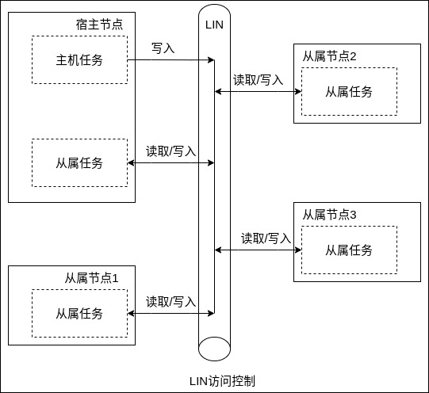
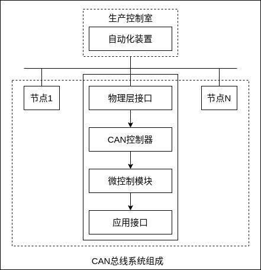
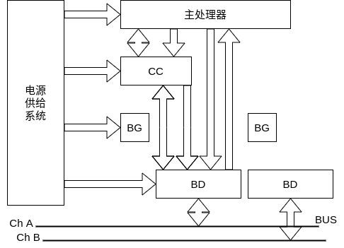

汽车总线是指汽车内部导线采用总线控制的一种技术，LIN(局部互联协议)和CAN(控制器局域网)是当前汽车普遍采用的汽车总线，还有用于汽车多媒体和导航的 MOST 总线等。另外，以太网络是一个已经被认为可取代旧有车用总线如多媒体接口 MOST、支持安全关键功能之通用高速传输接口 FlexRay 等的潜力技术。

随着线控系统数量的增多，各线控系统不可能独立工作，例如转向和制动就需要进行协调控制，实现资源共享减少延迟，以满足不同情况下对转向能力的制动效能的要求。因此对`通信时间的离散性和延时性`提出了更高的要求。传统基于事件的网络通信协议当几个信息同时发送时，往往会造成网络交通拥挤，虽然可以通过仲裁机制来保证这些信息以既定的优先级发送，但往往会造成某些信息的延迟。目前基于`时间触发`的网络协议已经被汽车企业广泛采用，在明确定义的时间点执行操作，即各线控系统同步之后，每个系统在一个特定的时间窗口传送自己的信息，而不必再去竞争总线，提高了数据的传输速率和可靠性。

目前，车用总线技术被美国汽车工程师协会(SAE)下属的汽车网络委员会按照协议特性分为 A、B、C、D 4 类。

| 类别 | 对象 | 位速率(Kb/s) | 应用范围 | 主要总线 |
|:----|:----|:-------------|:-------|:--------|
| A   | 面向传感器执行器的低速网络 | 1~10 | 电动门窗、座椅调节、灯光照明等控制 | TTP/A、LIN |
| B   | 面向独立模块间数据共享的中速网络 | 10~125 | 电子车辆信息中心、故障诊断、仪表显示、安全气囊等系统 | CAN |
| C   | 面向高速、实时闭环控制的多路传输网 | 125~1000 | 悬架控制、牵引控制、发动机控制、ABS 等系统 | CAN、TTP/C、FlexRay |
| D   | 未定义 | >1000 | 汽车导航、多媒体娱乐等系统 | MOST/1394 |

### 本地互联网络 LIN

在 A 级标准中，LIN 总线应用比较广泛。本地互联网络(LIN)是面向汽车低端分布式应用的具有低成本、低速串行等特点的总线形式。

LIN 总线的`工作原理`是采用一主多从的模式，一个主节点可以支持 16 个从节点，在主从设备之间只需要一根电压为 12V 的信号线。这种主要面向"传感器/执行器控制"的低速网络，其最高传输速率可达 20Kb/s，应用于电动门窗、座椅调节、灯光照明等控制系统。通过 CAN 网关，LIN 网络还可以和汽车的其他系统进行信息交换，实现更丰富的功能。

LIN Bus 访问控制方式如下。

LIN 包含一个宿主节点(Master)和一个或多个从属节点(Slave)。所有节点都包含一个被分解为发送和接收任务的从属通信任务，而宿主节点还包含一个附加的宿主发送任务。在实时 LIN 中，通信总是由宿主任务发起的。除了宿主节点的命名外，LIN 网络中的节点不使用有关系统设置的任何信息。可以在不要求其他从属节点硬件和软件的情况下向 LIN 中增加节点。宿主节点发送一个包含同步中断、同步字节和消息识别码的消息报头(称为起始报文)，从属任务在收到和过滤识别码后被激活并开始消息响应的传输。响应包含 2 个、4 个或 8 个数字字节和一个校验和(checksum)字节。起始报文和响应部分构成一个完整的报文帧(也称消息帧)。这种通信规则可以用多种方式来交换数据: 由宿主节点到一个或多个从属节点；由一个从属节点到宿主节点或其他的从属节点，通信信号可以在从属节点之间传播而不经过宿主节点或者宿主节点广播消息到网络中的所有节点。报文帧的时序由宿主节点控制。

LIN 总线上的所有通信都由宿主节点中的主机任务发起，主机任务根据进度表确定当前的通信内容，发送相应的帧头，并为报文帧分配帧通道。总线上的从机节点接收帧头之后，`通过解读标识确定自己是否应该对当前通信做出响应、做出何种响应`。基于这种`报文过滤`的方式，LIN 可实现多种数据传输模式，且一个报文帧可以同时被多个节点接收利用。

总线特点:
- 可靠传输。信号传输时间可靠，传输速率很高，最高速率可以达到 20kb/s。一主多从模式不需要仲裁机制。
- 低成本。
- 在网络上增加新的节点不需要在 LIN 从属节点做硬件和软件更改。

LIN 总线在汽车上得到广泛应用，如汽车的方向盘相关部件、汽车座椅控制、车门控制系统和车载传感器等。LIN 可以很容易地连接到汽车网络中的智能传感器、制动器或光敏器件等，并且得到十分方便的维护和服务。

### 控制器局域网络 CAN

#### 1 概述

控制器局域网(Controller Area Network,CAN)总线是一种用于实时应用的串行通信协议总线，它可以使用双绞线来传输信号。CAN 总线是一种多主方式的串行通信总线，基本设计规范要求有高位速率、高抗电子干扰性，并且能够检测出产生的任何错误。

汽车总线系统的研究与发展可以为分为 3 个阶段。研究汽车的基本控制系统(也称舒适总线)，如照明、电动车窗、中央集控锁等；研究汽车的主要控制系统(也称动力总线)，如电喷ECU控制系统、ABS系统、自动变速锁等；研究汽车各电子控制系统之间的综合、实时控制和信息反馈。在汽车上主要采用两种 CAN 总线，一种用于驱动系统的高速 CAN、速率一般可达到 500Kb/s，最高可达 1000Kb/s；另一种用于车身系统低速 CAN，速率是 125Kb/s。驱动系统 CAN(也称动力CAN)主要连接对象是发动机控制器(ECU)、ABS控制器、安全气囊控制器等，车身CAN(也称舒适CAN)主要连接和控制汽车内外部照明、灯光信号、空调、刮水电机、中央门锁与防盗控制开关、故障诊断系统、组合仪表及其他辅助电器等。

CAN 通信是同步半双工串行通信总线，经过 ISO 标准化后 CAN 产生了基于通信速率为 125Kb/s~1Mb/s 的高速通信标准——ISO11898 和基于通信速率为 125Kb/s 的低速通信标准——ISO11519。

为了解决总线上信息增多产生的信息延迟现象，博世在标准 CAN 协议扩展了支持时间触发的协议——TTCAN。由于标准 CAN 在汽车领域的成功，TTCAN 或许也将成为未来线控领域广泛应用的总线协议。

#### 2 工作原理

CAN 采用了 3 层模型: 物理层、数据链路层和应用层。支持的拓扑结构为总线型。传输介质为双绞线、同轴电缆和光纤等。采用双绞线通信时，速率可达 1Mb/s，节点数可达 110。

CAN 协议主要有 5 种帧，数据帧、远程帧、错误帧、过载帧和帧间隔。各种帧的用途如下。

| 帧 | 帧用途 |
|:--|:------|
| 数据帧 | 用于发送单元向接收单元传送数据的帧 |
| 远程帧 | 用于接收单元向具有相同 ID 的发送单元请求数据的帧 |
| 错误帧 | 用于当检测出错误时向其他单元通知错误的帧 |
| 过载帧 | 用于接收单元通知其尚未做好接收准备的帧 |
| 帧间隔 | 用于将数据帧及远程帧与前面的帧分离开来的帧 |

CAN 的通信采用`多主竞争`方式结构: 网络上任意节点均可以在任意时刻主动地向网络上其他节点发送信息，而不分主从，即当总线空闲时，各个节点都有权使用网络。在发生冲突时，采用非破坏性总线优先仲裁技术；当几个节点同时向网络发送消息时，运用逐位仲裁原则，借助帧中开始部分的表示符，优先级低的节点主动停止发送数据，而优先级高的节点可不受影响地继续发送信息，从而有效地避免了总线冲突，使信息和时间均无损失。

CAN 总线上的节点向总线发送数据时，都是以报文的形式发送到总线上的每一个节点，对于总线上的每一个节点，无论数据是否发给自己，都会对数据进行接收。具体来说，当某个节点向另一个节点发送数据时，首先该节点把数据和自己的标识符传送给自己的 CAN 芯片，当节点收到总线分配后，转为发送报文状态，CAN 芯片将节点的数据组织成报文的格式发出，其他节点处于接收状态。每个处于接收状态的节点对接收到的报文进行检测，判断报文是否是发给自己的，以确定是否有效处理。

由于 CAN 总线上任意节点可在任意时刻主动地向网络上其他节点发送信息而不分主次，因此可在各节点之间实现自由通信。当总线上挂载很多节点时，总线上信息就会增多，多个单元同时开始发送时，各发送单元从仲裁段的第一位开始进行仲裁。连续输出显性电平最多的单元可继续发送。具有相同 ID 的数据帧和远程帧在总线上竞争时，仲裁段的最后一位(RTR)为显性位的数据帧具有优先权，可继续发送。

CAN 的通信协议主要由 CAN 总线控制器完成。CAN 控制器主要由实现 CAN 总线协议部分和微控制器接口部分电路组成。通过简单的连接即可完成 CAN 协议的物理层和数据链路层的所有功能，应用层功能由微控制器完成。CAN 总线上的节点既可以是基于微控制器的智能节点，也可以是具有 CAN 接口的 I/O 器件。

CAN 总线属于`现场总线`(意思应该是非开放式网络)的范畴，CAN 总线系统的一般组成模式如下图所示。

#### 3 特点

CAN 总线具有以下特点:
- 具有实时性强、传输距离较远、抗电磁干扰能力强、成本低等优点
- 采用双线串行通信方式，检错能力强，可在高噪声干扰环境中工作
- 具有优先权和仲裁功能，多个控制模块通过 CAN 控制器挂到 CAN-bus 上，形成多主机局部网络
- 可根据报文的 ID 决定接收或屏蔽该报文
- 具备可靠的错误处理和检错机制
- 发送的信息遭到破坏后，可自动重发
- 节点在错误严重的情况下具有自动退出总线的功能
- 报文不包含源地址或目标地址，仅用标志符来指示功能信息、优先级信息

具体如下。

1) 多主竞争式的总线结构。CAN 总线上的节点没有主从之分，所有的节点可以在任意时刻向其他节点发送信息，实现节点之间的相互通信。
2) 取消了单元的地址信息。CAN 总线不同于其他总线很重要的一点就是不再使用地址将节点进行编码，而是通过报文的 ID 来区分每个节点，这就使得在 CAN 总线上的节点数量在理论上几乎不受限制。
3) 独特的逐位冲突仲裁原则。当多个节点同时发送信息时，为了避免总线上发生冲突，CAN 总线的仲裁机制便会发生作用。在报文仲裁段，显性电平多的报文优先级最高。可以根据消息的重要性进行优先级的安排，例如在无人驾驶汽车上，很多传感器的信号都会汇总到 CAN 总线上去，但是不同的传感器的信息的紧急程度不同，因此，不重要的信息可以将优先级安排得小一些。
4) 自我诊断功能。CAN 总线可以对自身的状态进行检测，包括 CRC 错误、应答错误、固定位错误、填充错误和形式错误等。当检测到错误时，CAN 控制器会即刻在下一位发出错误帧，根据发生错误的不同，设备可能处于错误主动状态、错误被动状态以及总线关闭状态。

### CAN FD 总线

随着系统复杂性和通信量的增加，传统的 CAN 总线由于带宽的限制已经难以满足市场需求。为了进一步提高传输速率，CAN 总线的升级版—— CAN FD(CAN with Flexible Data-Rate)应运而生。

CAN FD 总线继承了 CAN 总线的主要特性，提高了 CAN 总线的网络通信带宽，改善了错误帧漏检率，同时可以保持网络系统大部分软硬件特别是物理层不变。这种相似性使 ECU 供应商不需要对 ECU 的软件部分做大规模修改即可升级汽车通信网络。

CAN FD 采用了两种方式来提高通信的速率: 一种方法为缩短时间提高位速率；另一种方式为加长数据场长度、减少报文数量、降低总线负载率。在 CRC 检验段采用了三种多项式来保证高速通信下的数据可靠性。
- 可变速率(CAN with Flexible Data-Rate)。从主控制场中的 BRS 位到 ACK 场之前(含 CRC 分界符)为可变速率，其余部分为原 CAN 总线用的速率。两种速率各有一套位时间定义寄存器，它们除了采用不同的位时间单位 TQ 外，位时间各段的分配比例也可不同。
- 新的数据场长度。CAN FD 对数据场的长度做了很大的扩充，DLC 最大支持 64 字节，在 DLC 小于或等于 8 时与原 CAN 总线是一样的，大于 8 时则有一个非线性的增长，最大的数据场长度可达 64 字节。
- CRC 校验场。在 CAN FD 协议标准化的过程中，通信的可靠性也得到了提高。

尽管 CAN FD 继承了绝大部分传统 CAN 的特性，但是从传统 CAN 到 CAN FD 的升级，仍需要做很多的工作。在硬件和工具方面，要使用 CAN FD，首先要选取支持 CAN FD 的 CAN 控制器和收发器，还要选取新的网络调试和监测工具。在网络兼容性方面，对于传统 CAN 网段的部分节点需要升级到 CAN FD 的情况要特别注意，由于帧格式不一致的原因，CAN FD 节点可以正常收发传统 CAN 节点报文，但是传统 CAN 节点不能收发 CAN FD 节点的报文。

总之，CAN FD 协议是 CAN-BUS 协议的最新升级，将 CAN 的每帧 8 字节数据提高到 64 字节，波特率从最高的 1Mb/s 提高到 8~15Mb/s，使得通信效率提高 8 倍以上，大大提升了车辆的通信效率。

### 高速容错网络协议 FlexRay

高速容错网络协议(FlexRay)是一种用于汽车的高速、可确定性的，具备故障容错能力的总线技术。FlexRay 总线数据收发既支持`时间触发`访问方式，也支持`事件触发`访问方式。利用时间触发通信时，网络中的各个节点预先知道彼此将要进行通信的时间，接收器提前知道报文到达的时间，报文在总线上的时间可以预测出来，FlexRay 协议也可以确保将信息延迟和抖动降至最低，尽可能保持传输的同步与可预测。这对需要持续及高速性能的应用(如线控制动、线控转向等)来说是非常重要的。

FlexRay 总线将车载网络中的独立完成相应功能的控制单元视为节点，主要有电源供给系统(Power Supply)、主处理器(Host)、固化FlexRay通信控制器(Communication Controller)、可选的总线监控器(Bus Guardian)和总线驱动器(Bus Driver)等。如下图所示。

主处理器提供和产生数据，并通过 FlexRay 通信控制器传送出去。其中 BD 和 BG 的个数对应于通道数，与通信控制器和微处理器相连。总线监控逻辑必须独立于其他的通信控制器。总线驱动器连接着通信控制器和总线，或是连接总线监控器和总线。节点的两个通信过程如下:
- 发送数据: Host 将有效的数据送给 CC，在 CC 中进行编码，形成数据位流，通过 BD 发送到相应的通道上。
- 接收数据: 在某一时刻，由 BD 访问栈，将数据位流送到 CC 进行解码，将数据部分由 CC 传送给 Host 。

FlexRay 的拓扑主要分为 3 种: 总线状、星状、混合状。通常，FlexRay 节点可以支持两个信道，因而可以分为单信道和双信道两种系统。在双信道系统中，不是所有节点都必须与两个信道连接。

当 FlexRay 总线通信过程中出现数据错误时，该周期里接收到的所有数据都会被丢弃，但没有重发机制。所有节点会继续进行下一个周期的通信。FlexRay 同样也有错误计数器，当一个节点发送接收错误过多时会被踢出总线。

### MOST 总线

MOST(Media Oriented Systems Transport，多媒体传输系统)是一种用于多媒体数据传输的网络系统，该系统将符合地址的信息传送到某一接收器上，在这一点上，与 CAN 总线是不同的。

MOST 网络以光纤为载体，通常是环状拓扑结构，布线只需要单根光纤。MOST 可提供高达 50Mb/s 的传输速率，远远超过传统车载网络。常见的 MOST 网络有 3~10 节点，最多可以有 64 个节点。一个时序主控者负责驱动系统时钟、生成帧数据即 64 字节序列数据。可以同时满足 15 个不同音频流的播放，环中的每一个节点都代表着多媒体设备。剩下的节点都充当从控者，有一个节点充当用户控制界面或 MMI。一般来说，这个节点也是时序主控者。

MOST 总线具有传输速度快，声音、图像实时处理，可以与多种网络连接等特点。由于传输数据量大、损耗小、速度快、抗干扰性强，故可连接汽车音响系统、视频导航系统、车载电视、高保真音频放大器、车载电话、CD播放器等模块。因此，目前高端汽车大多数采用 MOST 系统连接其车载影音娱乐系统。

### 车载以太网

车载以太网是在民用以太网的基础上，改变了物理接口的电气特性，并结合车载网络需求专门定制新标准的以太网络。

目前的技术而言，车载以太网为主干、CAN 作为子系统的通信方式既保留了 CAN 实时、安全的特性，又能够提升通信速度与传输距离，同时还保证了成本的控制，很有可能广泛地应用到自动驾驶车辆车载通信中。

CAN 总线与车载以太网的对比

| 总线类型 | CAN 总线 | 以太网 |
|:--------|:--------|:------|
| 传输速率 | 5Kb/s~1Mb/s | 10Mb/s、100Mb/s等 |
| 容错机制 | 信号分优先级、采取非破坏仲裁技术、实时性好、稳定性高 | 带有冲突检测的载波侦听多路访问协议，实时性差；超时重发机制，故障易扩散 |
| 成本核算 | 仅需两根线材即可完成挂接 | 需经过交换机，增加物料 |
| 网络安全 | 专用现场总线，较为安全 | 开放式网络，易被攻击 |

