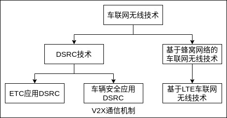

车用无线通信技术(Vehicle to Everything,V2X)是将车辆与一切事物相连接的新一代信息通信技术，其中 V 代表车辆，X 表示任何与车交互信息的对象，当前 X 主要包含车、人、交通路侧基础设施和网络。V2X 概述交互的信息模式包括: 车与车之间(Vehicle to Vehicle,V2V)、车与路之间(Vehicle to Road,V2R)、车与路侧基础设施(如红绿灯、交通摄像头、路侧单元等)之间(Vehicle to Infrastructure,V2I)、车与人之间(Vehicle to Pedestrian,V2P)、车与网络之间(Vehicle to Network,V2N)的交互，即 "人""车""路""云"。

V2X 是一种网状网络，网络中的节点(汽车、智能交通灯等)可以发射、捕获并转发信号。利用 V2X，车辆可以获取周围环境的未知参数及附近车辆的运行状态，这些状态包括速度、位置、行驶方向、制动等基本的安全信息。然后车载端主动安全算法将处理所获取的信息，并按照优先级对信息进行控制从而规避风险。V2X 技术开启了对四周威胁的 360° 智能感知，这一技术能够在各种威险情况下提醒驾驶员，从而大大减少汽车碰撞事故的发生并缓解交通拥堵。

相比传统雷达，V2X 通信传感系统有以下几点优势。
- 覆盖面更广。300~500m的通信范围相比十几米的雷达探测范围要远得多，不仅是前方障碍物、身旁和身后的建筑物、车辆都会互相连接，大大拓展了驾驶员的视野范围，驾驶员能获得的信息更多更立体。
- 有效避免盲区。由于所有物体都接入互联网，每个物体都会有单独的信号显示，因此即便是视野受阻，通过实时发送的信号可以显示视野范围内看不到的物体状态，也就降低了盲区出现的概率，充分避免了因盲区而导致的潜在伤害。
- 对于隐私信息的安全保护性更好。

### V2X 分系统概述

V2V (Vehicle to Vehicle)是指通过车载终端进行车辆间的通信。车载终端可以实时获取周围车辆的速度、位置、行车情况等信息，车辆间也可以构成一个互动的平台，实时交换文字、图片和视频等信息。将 V2V 技术应用于交通安全领域，能够提高交通的安全系数，作用是减少交通事故，降低直接和非直接的经济损失，以及减少地面交通网络的拥塞。当前面车辆检测到障碍物或车祸等情况，它将向周围发送碰撞警告信息，提醒后面的车辆潜在的危险。

V2R (Vehicle to Road)是指车与路之间的通信。车-路通信主要面向非安全性应用，以 ETC 系统为代表。例如，车辆经过特定的 ETC 车道，在不需停车和收费人员采取任何操作的情况下，能自动完成收费过程。除此之外，基于车-路通信的专用短程通信应用还可以用于电子地图的下载和交通调度等。

V2I (Vehicle to Infrastructure)是指车载设备与路侧基础设施(如红绿灯、交通摄像头、路侧单元等)进行通信，路侧基础设施也可以获取附近区域车辆的信息并发布各种实时信息。V2I 通信主要应用于实时信息服务、车辆监控管理等。

V2P (Vehicle to Pedestrian)是指弱势交通群体(如行人、骑行者等)使用用户设备(如手机、笔记本计算机等)与车载设备进行通信，包括广泛的道路使用者。V2P 通信主要应用于信息服务、避免或减少交通事故等。行人检测系统可以在车辆、基础设施或与行人本身一起实现，以向驾驶员、行人或两者提供警告。

V2N (Vehicle to Newwork)允许在车辆和 V2X 管理系统以及 V2X 应用服务器之间进行广播或单播通信，通过使用蜂窝网来实现。车辆能够收到有关道路上发生的交通事故的广播警报，或原计划路线上的拥挤或排队警告等。V2V 和 V2I 都是代表近距离通信，而通过 V2N 技术实现远程数据传输。随着 5G 时代的到来，V2N 的能力会进一步加强，更有助于自动驾驶信息的获取与传输。

### 通信机制

V2X 通信技术目前有专用短程通信技术(Dedicated Short Range Communication,DSRC)与基于 LTE 车联网无线技术两大路线。

专用短程通信 DSRC 是一种高效的无线通信技术，它可以实现特定区域内(通常数十米)对高速运动下的移动目标的识别和双向通信，例如实时传输图像、语音和数据信息，将车辆和道路有机连接。它是针对智能交通系统领域(ITS)中，车辆和道路基础设施间的信息交换而开发的一种适用于短距离的快速移动的目标识别技术。它可以提供高速的无线通信服务，并且能保持传输延时短和系统的可靠性。其在延迟、移动性、通信距离方面有着无可替代的优势，特别适用于车辆安全应用。目前全球范围内的大多车路协同项目的研究，均采用 DSRC 技术建立车辆网络。其技术特点如下:
- 通信距离一般在数十米(10~30m)。
- 通信速率: 250~500kb/s，能承载大宽带的车载应用信息。
- 完善的加密通信机制: 支持 3DES、RSA 算法；高安全性数据传输机制，支持双向认证及加\解密。

LTE-V 是基于第四代移动通信技术的扩展技术，最早由大唐公司提出，它是专为车辆与车辆间通信协议设计的 V2X 标准。LTEX V2X 针对车辆应用定义了两种通信方式: 集中式(LTE-V-Cell)和分布式(LTE-V-Direct)。

作为车联网的 V2X 无线通信技术，虽然 DSRC 有先发优势，但是 LTE-V2X 与 DSRC 相比，具有以下技术优势。
- 更好的远距离数据传输可达性。
- 更高的非视距(NLOS)传输可靠性。
- 网络建设和维护的优势。

### 与自动驾驶

随着对自动驾驶研究的深入，单车智能自动驾驶的局限性也凸显出来。例如，传感器探测距离有限，并且容易受到遮挡；单车智能对于无信号交叉口通行待需要群体决策的场景无能为力。同时，考虑到车端传感器的安全冗余、传感器成本等因素，车路协同又一次被提及。车路协同是指，基于无线通信、传感探测等技术获取车辆和道路信息，通过车-车、车-路通信进行交互和共享，实现车辆和基础设施之间智能协同与配合，以达到优化利用系统资源、提高道路交通安全、缓解交通拥堵的目标。车路协同目前成为自动驾驶落地的重要手段。

V2X 是实现车路协同的重要技术。路侧传感器得到的感知信息可以通过 V2I 通信传输给自动驾驶车辆，自动驾驶车辆可以根据通过 V2I 通信获得的感知信息实现自动驾驶功能。路侧计算设备可以作为控制中心，自动驾驶车辆通过 V2I 通信将自身的运行状态、驾驶意图等信息上报到路侧计算设备，路侧计算设备可以综合所有车辆的信息，指导车轮的协同通行。

车辆协同可以首先在限定场景下实现。例如在高速公路部署车路协同设备，低级别(L2、L3)自动驾驶车辆可以根据路侧感知实现高级别(L4及以上)自动驾驶。以如在停车场，车辆可以根据部署在停车场内的摄像头、雷达等传感器，实现自主泊车。
