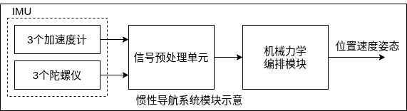
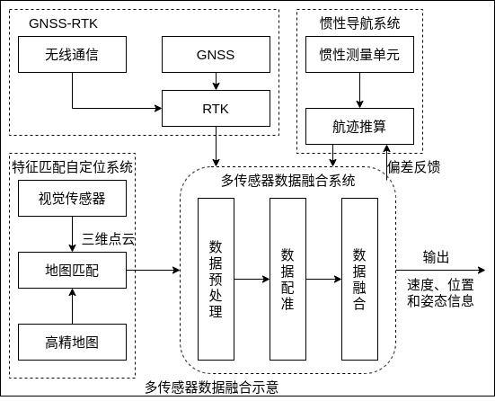

现有的车载传感器主要包括超声波雷达、激光雷达、毫米波雷达、车载摄像头、红外探头等。主流的自动驾驶感知平台`以雷达和车载摄像头为主`，并呈现多传感器融合发展的趋势。

各传感器各有优劣，无法在安装单一传感器的情况下完成对自动驾驶功能性和安全性的全面覆盖。因此，完备的自动驾驶系统应该是各个传感器之间借助各自所长相互融合、功能互补、互为备份、互为辅助。

主流车载传感器性能对比

| 性能          | 激光雷达 | 毫米波雷达 | 摄像头 | GPS/IMU |
|:-------------|:--------|:---------|:------|:--------|
| 远距离测量能力 | 优       | 优       | 优    | 优       |
| 分辨率        | 良       | 优       | 优    | 优      | 
| 低误报率      | 良       | 优       | 一般   | 优      |
| 温度适应性    | 优       | 优       | 优     | 优      |
| 不良天气适应性 | 较差     | 优       | 较差   | 优      |
| 灰尘/潮湿适应性 | 较差    | 优       | 较差   | 较差    |
| 低成本硬件     | 较差    | 优        | 优    | 良      |
| 低成本信号处理  | 较差    | 优       | 较差   | 良      |

### 激光雷达

激光雷达的工作原理是通过首先向目标发射一束激光，然后根据接收——反射的时间间隔确定目标物体的实际距离。同时结合这束激光的发射角度，利用基本的三角函数原理推导出目标的位置信息。

激光雷达可以用于测量物体距离和表面形状，精度可以达到厘米级。由于具有能量密度高、方向性好的特点，探测距离往往能达到 100m 以上。

激光雷达在自动驾驶运用中拥有两个核心作用。
1. 三维建模进行环境感知。通过激光扫描可以得到汽车周围环境的三维模型，运用相关算法比对上一帧和下一帧的变化可以较容易地探测出周围的车辆和行人。
2. SLAM 加强定位。三维激光雷达的另一大特性是同步建图(SLAM)，实时得到全局地图。通过和高精地图中特征物的比对，可以实现导航及加强车辆定位精度等功能。

激光雷达联合 GNSS/IMU 与高精地图等手段进行加强定位时，一方面通过 GNSS 得到初始位置信息，再通过 IMU 和车辆的 Encoder(编码器)配合得到车辆的初始位置；另一方面，将激光雷达的 3D 点云数据，包括几何信息和语义信息进行特征提取，并结合车辆的初始位置进行空间变化，获取基于全局坐标系下的矢量特征。最后，将初始位置信息，激光雷达提取的特征跟高精地图的特征信息进行匹配，从而获取一个准确的定位。如下图所示。

LiDAR 以线数及距离两大因素为标准，价格从几百美元到几万美元不等。单纯激光雷达的应用在国内已相对较广，像扫地机器人使用的便是单纯激光雷达。单纯激光雷达可以获取二维数据，但无法识别目标的高度信息，而多线激光雷达则可以识别 2.5 维甚至是三维数据。目前，在国际市场上推出的主要有 4 线、8 线、16 线、32 线、64 线和 128 线。随着线数的提升，每秒采集的数据点就越多，所要处理的数据量也非常巨大。同时，线数越多也代表着激光雷达的造价越昂贵。

激光雷达想在无人车上普及首先应该降低价格。有两种解决办法: 其一是采用低线数雷达配合其他传感器，但需搭配拥有极高算力系统的无人车；其二是采用固态激光雷达。激光雷达最贵的就是机械旋转部件，固态激光雷达无须旋转部件，采用电子设备替代，体积更小，方便集成，系统可靠性更高，成本也可大幅降低。

在自动驾驶领域，激光雷达是目前最有效的方案，被认为是最精准的自主感知手段，其有效感知范围超过 120m，而精度可以达到厘米级。但由于现阶段价格高昂，无法部署在量产车上，是目前最难以跨越的硬件门槛。多线激光雷达的成本下降将会显著加速自动驾驶汽车的量产。

### 摄像头

车载摄像头的工作原理是: 首先采集图像，将图像转换为二维数据；然后，对采集的图像进行模式识别，通过图像匹配算法识别行驶过程中的车辆、行人、交通标志等；最后，依据目标物体的运动模式或使用双目定位技术，估算目标物体与本车的相对距离和相对速度。

摄像头可以获得最接近人眼获取的周围环境信息，但是也存在缺点。首先，基于视觉的感知技术受光线、天气影响较大，在恶劣天气和类似于隧道内的昏暗环境中其性能难以得到保障；其次，物体识别基于机器学习资料库，需要的训练样本很大，训练周期长，也难以识别非标准障碍物。此外，由于广角摄像头的边缘畸变，得到的距离准确度较低。

从应用方案出发，目前摄像头可划分为单目前视、单目后视、立体(双目)前视和环视摄像头 4 种，如表所示

| 自动驾驶辅助功能 | 使用摄像头 | 具体功能简介 |
|:--------------|:---------|:------------|
| 车道偏离预警 LDW | 前视 | 当前视摄像头检测到车辆即将偏离车道线时，会发出警报 |
| 前向碰撞预警 FCW | 前视 | 当摄像头检测到与前车距离过近，可能发生追尾时，会发出警报 |
| 交通标志识别 TSR | 前视、侧视 | 识别前方道路两侧的交通标志 |
| 交通保持辅助 LKA | 前视 | 当前视摄像头检测到车辆即将偏离车道线时，会向控制中心发出信息，然后由控制中心发出指令，及时纠正行驶方向 |
| 行人碰撞预警 PCW | 前视 | 前摄像头会标记前方道路行人，并在可能发生碰撞时及时发出警报 |
| 盲点监测 BSD | 侧视 | 利用侧视摄像头，将后视镜盲区内的景象显示在驾驶舱内 |
| 全景泊车 SVP | 前视、侧视、后视 | 利用车辆四周摄像头获取的影像，通过图像拼接技术，输出车辆周边的全景图 |
| 泊车辅助 PA | 后视 | 泊车时将车尾的影像显示的驾驶舱内，预测并标记车轨迹，辅助驾驶员泊车 |
| 驾驶员注意力监测 | 内置 | 安装在车内，用于检测驾驶员是否疲劳、闭眼等 |

- 单目前视摄像头一般安装在前挡风玻璃上部，用于探测车辆前方道路，识别道路、车辆、行人等。先通过图像匹配进行目标识别(各种车型、行人、物体等)，再通过测量目标物体在图像中的大小估算目标距离。单目前视视觉方案的技术难点在于机器学习模型的智能程度或者模式识别的精度。
- 单目后视摄像头一般安装在车尾，用于探测车辆后方环境，技术难点在于如何适应各种恶劣环境。
- 立体(双目)前视摄像头通过对两幅图像视差的计算，直接对前方景物(图像所拍摄到的范围)进行距离测量，而无须判断前方出现的是什么类型的障碍物。使用这种方案，需要两个摄像头有较高的同步率和采样率，因此技术难点在于双目标定及双目定位。另外，双目摄像头的测距精度依赖两个摄像头的安装距离，对安装精度和设备刚性也有比较高的要求。
- 环视摄像头一般至少包括 4 个摄像头，分别安装在车辆前、后、左、右侧，实现 360 度环境感知，难点在于畸变还原与对接。

| 安装部位 | 摄像头类型 | 应用场景 |
|:-------|:----------|:--------|
| 前视    | 单目、双目 | FCW、LDW、SR、ACC、PCW |
| 环视    | 广角      | 全景泊车、LDW |
| 后视    | 广角      | 后视泊车辅助 |
| 侧视    | 广角      | 盲点检测、替代后视镜 |
| 内置    | 广角      | 闭眼提醒 |

- 前视摄像头一般采用 55° 左右的镜头以得到较远的有效距离，双目摄像头需要装在两个位置。前视摄像头可以实现车道偏离预警、车辆识别、行人识别、道路标识识别等 ADAS 主动安全的核心功能，未来将成为自动紧急制动(AEB)、自适应巡航(ACC)等主动控制功能的信号入口。
- 环视使用的是广角摄像头，通常在车四周装备 4 个进行图像拼接以实现全景图，通过辅助算法可实现道路感知。
- 后视采用广角或者鱼眼镜头，主要为倒车使用。
- 侧视一般使用两个广角摄像头，完成盲点检测等工作，可代替后视镜。这一功能也可由超声波雷达替代。
- 内置使用的同样是广角镜头，安装在车内后视镜处，完成在行驶过程中对驾驶员的闭眼提醒。

车载摄像头需要具备的首要特性是高速采集图像的能力，特别是在高速行驶场合，系统必须能记录关键驾驶状况、评估这种状况并实时启动相应措施。为避免两次图像信息获取间隔期间自动驾驶的距离过长，要求车载摄像头具有最慢不低于 30f/s 的影像捕捉速率。在功能上，车载摄像头需要在复杂的运动路况环境下保证采集到稳定的数据。具体要求如下:
- 高动态。在较暗环境及明暗差异较大时仍能实现识别，要求摄像头具有高动态的特性。
- 中低像素。为降低计算处理的负担，摄像头的像素并不需要非常高。目前30万~120万像素已经能满足要求。前视摄像头为了实现远距离物体成像需要更高像素，200万~500万甚至更高像素已经成为发展趋势。
- 角度要求。对于环视和后视，一般采用 135° 以上的广角镜头，前置摄像头对视距要求更大，一般采用 55° 的范围。

### 毫米波雷达

毫米波雷达通过发射无线电信号(毫米波波段的电磁波)并接收反射信号来测定汽车车身周围的物理环境信息(如汽车与其他物体之间的相对距离、相对速度、角度等)，感知系统根据所探知的物体信息进行目标追踪和识别分类，进而结合车身动态信息进行数据融合，完成合理决策，降低事故发生概率。

毫米波兼具微波制导和光电制导的优点，可以检测到 30~100m 甚至更远的物体。同时，毫米波雷达不易受天气状况限制，即使是雨雪天也能正常运作，穿透雾、烟、灰尘的能力强；具有全天侯、全天时的工作特性，且探测距离远，探测精度高，被广泛应用于车载距离探测，如自适应巡航、碰撞预警、盲区探测、自动紧急制动等。

在自动驾驶汽车领域，车载毫米波雷达通过天线发射毫米波，接收目标反射信号，经后台处理后快速准确地获取汽车车身周围的物理环境信息(如汽车与其他物体之间的相对距离、相对速度、角度、运动方向等)，然后根据所探知的物体信息进行目标追踪和识别分类，进而结合车身动态信息和其他传感器接收的信息进行数据融合，通过中央处理单元(ECU)进行智能处理，经合理决策后，及时对汽车运动执行控制，从而实现自动驾驶。原理图如下。

相比激光雷达，毫米波雷达精度低、可视范围角度偏小，一般需要多个雷达组合使用。毫米波雷达的主流工作频段为 24GHz 和 77GHz，分别应用于中短距和中长距测量。短距探测精度高，长距侦测范围更广。为完全实现自动驾驶辅助系统的各项功能，一般需要配置`1长+4中短`一共 5 个毫米波雷达。

毫米波雷达的主要问题是存在互相干扰的可能。频率不同的电磁波在传输过程中相互独立，但是频率相近的电磁波却会互相叠加，使信号劣化。调频连续波雷达本身不能免疫干扰。随着道路上装载毫米波雷达的车辆增加，相似频段的雷达信号也随之增加，雷达之间的干扰不可避免。干扰信号可以通过直线传播直接干扰，也可以经过物体反射从而间接干扰。这样的结果是大大降低了信号的信噪比，甚至会导致雷达"致盲"。

### 超声波雷达

超声波雷达是通过发射并接收 40kHz 的超声波，根据时间差算出障碍物距离。其测距精度是1~3cm。常见的超声波雷达有两种: 第一种是安装在汽车前后保险杠上的，用于测量汽车前后障碍物的驻车雷达或倒车雷达，称为超声波驻车辅助传感器(Ultrasonic Parking Assistant,UPA)；第二种是安装在汽车侧面，用于测量侧方障碍物距离的超声波雷达，称为自动泊车辅助传感器(Automatic Parking Assistant,APA)。

超声波雷达具有诸多优点。超声波能量消耗较为缓慢，防水、防尘性能好，传播距离较远，穿透性强，测距方法简单，成本低，且不受光线条件的影响。尤其是短距离测量中，超声波雷达的测距有着非常大的优势。但是，超声波是一种机械波，使得超声波雷达有着根源性的局限性。
- 对温度敏感。波速受温度影响，因此测量的精度也与温度直接相关。传播速度较慢时，若汽车行驶速度较快，使用超声波测距无法跟上汽车车距的实时变化，误差较大。
- 超声波散射角大，方向性较差，无法精确描述障碍物位置。在测量较远距离的目标时，其回波信号较弱。

超声波雷达在自动驾驶汽车上主要用于泊车系统、辅助制动等。通常一套倒车雷达需要安装 4 个 UPA 传感器，而自动泊车系统在倒车雷达的基础上再加 4 个 UPA 传感器和 4 个 APA 传感器。UPA 的探测距离一般在 15~250cm 之间，主要用于测量汽车前后方向的障碍物。APA 的探测距离一般在 30~500cm 之间，探测范围更远，因此相比于 UPA 成本更高，功率也更大。APA 传感器与倒车雷达工作频率不同，不形成干扰。

超声波雷达的基础应用是倒车辅助。在这个过程中，超声波传感器通常需要同控制器和显示器结合使用，从而以声音或者更直观的显示方式告诉驾驶员周围障碍物的情况，解除驾驶员泊车、倒车和启动车辆时前后左右探视引起的困扰，并帮助驾驶员扫除视野死角和视线模糊的缺陷，提高驾驶安全性。除障碍物检测外，超声波雷达还有许多应用场景，例如泊车位检测、高速横向辅助等。

### 导航定位系统

#### 1 卫星定位技术

在任何驾驶条件下，自动驾驶车辆均依赖于两种信息: 汽车位置和汽车行驶的速度，收集这些信息需要整合多种复杂技术，其中全球导航卫星系统(GNSS)起主要作用。当自动驾驶汽车拥有高精度的位置信息之后，就可以跟高精地图进行匹配，从而形成良好的导航功能。GNSS 系统也能为车载传感器的时间同步或者导航提供最基础的时空信息。

GPS 能提供全球性、全天候的定位、授时信息，并且有长期精度高、误差不随时间累积的优点。但在复杂的动态环境，尤其是在大城市中，GPS 信号容易受到高楼、高架桥、隧道等建筑物的遮挡和严重的多路径效应干扰，导致 GPS 定位信息产生米级甚至更大量级的误差。另外 GPS 的更新频率低(10Hz)，在车辆快速行驶时很难给出精准的实时定位。单纯依赖 GPS 的导航很有可能导致交通事故。因此，GPS 通常辅助以惯性传感器(IMU)用来增强定位的精度。IMU 是测量加速度与角速度的高频(1kHz)传感器，惯性导航的优点是不依赖于外界信息、抗干扰、数据更新频率高、短期精度高、能输出姿态信息等；但是，纯惯性导航的误差会随着导航时间的延长而迅速累积。

工作原理: GNSS 定位主要解决两个问题，一是观测瞬间卫星的空间位置，二是测量站点卫星之间的距离。空间位置即 GNSS 卫星在某坐标系中的坐标，为此首先要建立适当的坐标系来表征卫星的参考位置，而坐标又往往与时间联系在一起，因此，定位是基于坐标系统和时间系统来进行的。利用基本三角定位原理，GNSS 接收装置通过测量无线电信号的传输时间来测量距离。由每颗卫星的所在位置，和测量得到的每颗卫星与接收装置的距离，便可以算出接收器所在位置的三维坐标值。使用者至少需收到 3 颗卫星的信号才可确定自身的位置。实际使用中 GNSS 接收装置都是利用 4 个以上的卫星信号来确定使用者所在位置及高度。

卫星导航系统的误差从来源上可以分为 4 类: 与信号传播有关的误差，与卫星有关的误差，与接收机有关的误差以及地球潮汐、负荷潮等造成的其他误差。

#### 差分定位系统

减少甚至消除卫星定位的误差是提高定位精度的措施之一，而差分 GNSS(Differential GNSS,DGNSS)可有效地利用已知位置的基准站或流动站将公共误差估算出来，通过相关的补偿算法完成精确定位，消除公共误差，从而提高定位精度。

根据差分校正的目标参量的不同，差分 GNSS 主要分为位置差分、伪距差分和载波相位差分。位置差分技术与伪距差分技术都能满足基本定位导航等的精度需求，但是在车联网和自动驾驶领域还远远不能满足需求，从而促使发展出更加精准的 GNSS 差分技术，即载波相位差分技术，也称为实时动态差分技术(Real Time Kinematic,RTK)。RTK 是一种利用接收机实时观测卫星信号载波相位的技术，将数据通信技术与卫星定位技术相结合，采用实时解算和数据处理的方式，能够实现实时地为流动站提供在指定坐标系中的三维坐标，在极短的时间内实现厘米级高精度的定位。

传统的 RTK 定位技术虽然可以满足很多应用的要求，但流动站与基准站的距离不能太长，当距离大于 50km 时，现有 RTK 单历元解一般只能达到分米级的定位精度。网络 RTK 也称多基准站 RTK，是近年来基于传统 RTK 技术和差分 GNSS 技术等发展起来的一种实时动态定位新技术。与传统 RTK 相比，网络 RTK 扩大了覆盖范围，降低了作业成本，提高了定位精度，减少了用户定位的初始化时间。

#### 惯性导航定位

GNSS 是一个应用广泛

卫星导航作为定位方式有更新频率低的问题，只有 10Hz 左右，无法满足自动驾驶汽车的要求。因此，必须借助其他传感器和定位手段来共同增强定位的精度，惯性导航系统是其中最重要的部分。建立在牛顿定律基础上的惯性导航系统(Inertial Navigation System,INS)(简称惯导系统)不与外界发生任何光电联系，仅靠系统本身就能对车辆进行连续的三维定位和三维定向。

惯性导航系统是一种不依赖于外部信息、也不向外部辐射能量的自主式导航系统。其主要由 3 个模块组成: 惯性测量单元(Inertial Measurement Unit,IMU)、信号预处理单元和机载力学编排模块。如下图所示。

一个 IMU 包括 3 个相互正交的单轴的加速度计(Accelerometer)和 3 个相互正交的单轴的陀螺仪(Gyroscopes)。信号预处理部分对 IMU 输出信号进行信号调理、误差补偿，并检查输出量范围等，以使惯性传感器正常工作。

惯性导航系统以陀螺仪和加速度计为敏感元件，应用航迹推算法提供位置、速度和姿态等信息。汽车行驶数据的采集由以陀螺仪和加速度计组成的惯性测量单元来完成。

#### 多传感器融合定位

GNSS 是一个应用广泛、适用范围广、定位精度高的系统，但是当它应用于无人车辆时，其更新频率过低的缺点便相对突出，仅有 10Hz 左右的更新频率不足以满足无人驾驶系统对定时定位的要求。由于误差累积的原因，INS 惯性导航系统的准确度随时间和行驶距离的增加而降低，因此也无法完整保证定位的准确性；不过，它的更新频率较高，可以达到 200Hz 以上，满足自动驾驶系统的需求。通过适当的方法将 GNSS 与 INS 的数据进行融合，可以为车辆定位提供既准确又足够实时的位置信息。

多传感器信息融合的目标是利用各种传感器分离观测信息，对数据进行多级别、多方位和多层次的处理，产生新的有意义的信息。它的最终目的是利用多个传感器共同或联合操作的优势，来提高整个传感器系统的有效性。

多传感器融合的数据主要包括 GNSS-RTK、惯性导航系统和特征匹配自定位系统的输入数据。对这些数据进行预处理、数据配准和数据融合等处理后，输出车辆自身的速度、位置和姿态信息。如下图所示。

数据预处理可以考虑为传感器初始化及校准，传感器初始化即相对于系统坐标独立地校准每一个传感器。一旦完成了传感器初始化，就可以利用共同的目标开始相对的数据配准过程。所谓数据配准，就是把来自一个或多个传感器的观测或点迹与已知或已经确认的事件归并到一起，保证每个事件集合所包含的观测来自同一个实体的概率较大。具体地说，就是要把每批目标的点迹与数据库中各自的航迹配对。空间内存在较多目标，若将其配错将产生错误。在传感器配准过程中，收集足够的数据点来计算系统偏差，计算得到的系统偏差用以对调整后得到的传感器数据作进一步的处理。

传感器的配准是指多传感器数据"无误差"转换时所需要的处理过程，一般主要包括时间配准和空间配准两个方面。所谓时间配准，就是将关于同一个目标的各传感器不同步的测量信息同步到同一时刻。由于各传感器(系统)和融合处理中心之间传送信息所需的时间也各不相同，因此，各传感器发送数据有可能存在时间差，所以融合处理前须将不同步的信息配准到相同的时刻。所谓空间配准，又称为传感器配准，就是借助于多传感器对空间共同目标的测量，对传感器的偏差进行估计和补偿。对于同一系统内采用不同坐标系的各传感器的测量，定位时必须将它们转换成同一坐标系中的数据。对于多个不同子系统，各子系统采用的坐标系是不同的，所以在融合处理各子系统的信息前，也应将它们转换到同一测量坐标系中，而处理后还须将转换成各子系统坐标系的数据后，再传送给各个子系统。

数据融合需要借助融合算法。通过基于卡尔曼滤波的传感器融合技术，可以融合 GPS 和 IMU 数据。它们组合的优势有以下几点。
- 系统精度的提高。利用 GPS 的长期稳定性弥补 IMU 误差随时间累积的缺点。GPS/IMU 组合后的导航误差要比单独的 GPS 或单独的惯导系统可能达到的误差都小。
- 系统抗干扰能力的增强。利用 IMU 的短期高精度弥补 GPS 系统易受干扰、信号易失锁等缺点，同时借助 IMU 的姿态信息、角速度信息可进一步提高 GPS 系统快速捕获或重新锁定卫星信号的能力。
- 导航信息的补全。GPS/IMU 组合系统与单纯 GPS 相比，除了可以提供载体运动的三维位置和速度信息外，还可提供加速度、姿态和航向信息；GPS/IMU 组合系统可提供 100Hz 甚至更高的数据更新率。
