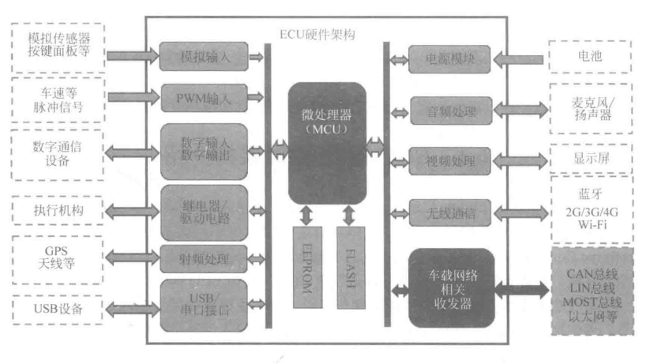

### DDT(Dynamic Driving Task)

动态驾驶任务，指汽车在道路上行驶所需的所有实时操作和策略上的功能(决策类的行为)，不包括行程安排、目的地和途径地的选择等战略上的功能。

### 车辆执行

包括通过方向盘来对车辆进行横向运行操作、通过加速和减速来控制车辆的纵向运动。

### 感知和判断(OEDR,Object and Event Detection and Response,也称为周边监控)

对车辆纵向运动方向操作、通过对物体和事件检测、认知归类和后续响应，达到对车辆周围环境的监测和执行对应操作、车辆运动的规划以及外界信息的传递。

### 动态驾驶任务支援(DDT Fallback)

自动驾驶系统在设计时候，需要考虑系统性的失效(导致系统不工作的故障)发生或者出现超过自组织系统原有的运行设计范围之外的情况，当这两者发生的时候，需给出最小化风险的解决路径。

### 设计运行域(Operational Design Domain,ODD,也有称为设计适用域或者设计运行范围)

一组参数，指自动驾驶系统被设计起作用的条件及适用范围，对已知的天气环境、道路情况(直路、弯路的半径)、车速、车流量等信息做出测定，以确保系统能力在安全环境之内。

### SLAM

Simultaneous Localization and Mapping，意为"即时定位与地图构建"。它时指运动物体根据传感器的信息，一边计算自身位置，一边构建环境地图的过程。由于传感器种类和安装方式的不同，SLAM 的实现方式和难度会有很大差异。按传感器来分，SLAM 主要分为激光、视觉两大类。

### ECU

ECU(Electronic Control Unit)，即电子控制单元，泛指汽车上所有电子控制系统，可以是转向 ECU，也可以是调速 ECU、空调 ECU 等。

一个 ECU 主要由硬件和软件两大部分组成。硬件主要负责采集输入信号、输出控制信号、通信接口控制等。软件主要是基于嵌入式系统对输入信号进行运算，并将运算结果转换为控制信号输出。

1) 硬件架构

ECU 硬件架构主要由微处理器(Microcontroller Unit,MCU)和外围电路组成。ECU 的核心部件主要是 MCU，根据 ECU 不同的功能需求，可以选用不同型号的 MCU。

2) 软件架构

对于软件构架，不同的 ECU，功能复杂程度不一样，软件需要处理的信号、算法差异也很大。复杂 ECU 的系统如车载导航，需要使用 Linux/Android 等操作系统来处理很多复杂任务。
