传统的 ECU 架构有以下两个缺点: 抽象程度低；基础软件模块少。针对这些问题，AUTOSAR 规范提出了抽象程度更高的解决措施，划分出更多的基础模块。为了实现应用软件和硬件模块的解耦，汽车电子软件架构被抽象成 4 层，从上至下依次为: 应用层(Application Layer)、运行时环境(Runtime Environment,RTE)、基础软件层(Basic Software,BSW)以及微控制器(Microcontroller)。应用层完全独立于硬件，只有基础软件层与硬件相关，而 RTE 实现这两者的隔离。

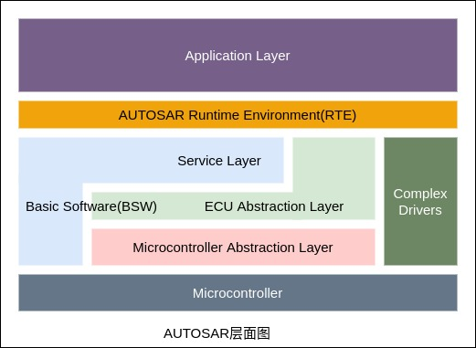

AUTOSAR 面临的挑战及其优点如下:

| 非AUTOSAR面临的挑战 | AUTOSAR方案 | AUTOSAR优势 |
|:------------------|:-----------|:------------|
| 对功能需求缺乏追溯手段，没有兼容性的工具链 | 需求交互格式标准化(ARXML) | 从内容和格式上改进了规范，为无缝的工具链提供可能 |
| 基础软件模块不能复用，带来的时间和精力浪费 | 基础软件(BSW) | 提高软件质量，供应商提供基础软件 |
| 升级主芯片带来大量的重新设计 | 微控制器抽象层(MCAL) | 主芯片可以随意替换，MCAL由芯片厂家提供 |
| 集成工作反馈 | 运行时环境(RTE) | 集成自动化 |
| 软件耦合性大 | 接口标准化 | 不同供应商可交互组件 |

### 模块构成

AUTOSAR 架构的分层式设计，用于支持完整的软件和硬件模块的独立性。如下图如下，中间 RTE(Runtime Environment)作为虚拟功能总线 VFB(Virtual Functional Bus)的实现，隔离了上层的应用软件层(Application Layer)与下层的基础软件层(Basic Software)，摆脱了以往 ECU 软件开发与验证时对硬件系统的依赖。

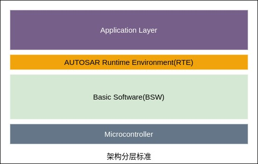

#### Application Layer(应用层)

应用层中的功能由各软件组件(Software Component,SWC)实现，组件中封装了部分或者全部汽车电子功能。其中包括对具体功能的实现以及对应描述，如控制大灯、空调等部分的运作，但与汽车硬件系统没有连接。

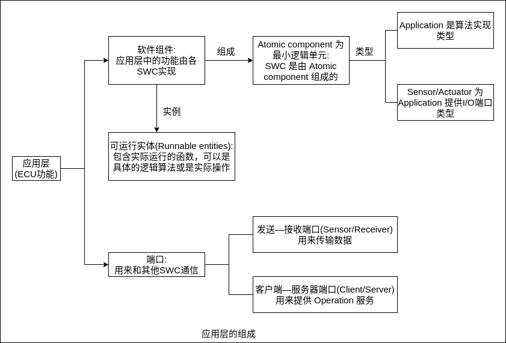

1.软件组件

软件组件由最小逻辑单元(Atomic Component)组成。最小逻辑单元有 Application、Sensor/Actuator 两种类型。其中 Application 是算法实现类型，能在各 ECU 上`自由映射`。Sensor/Actuator 是为 Application 提供 I/O 端口类型，用于与 ECU 绑定，但不像 Application 那样能在各 ECU 上自由映射。整个 SWC 的逻辑集合组合成 Composition。

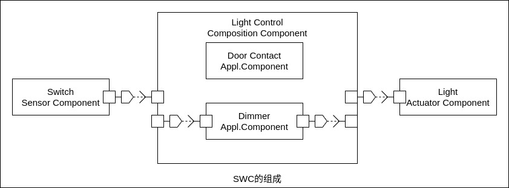

2.端口

端口(Ports)是 SWC 和 SWC 做接口(interface)通信使用，或者 SWC 通过 RTE 和 BSW 做接口(interface)通信使用。

Ports 主要分为 5 种类型:
- Send/Receiver(Receiver): 发送/接收接口（接收接口）
- Send/Receiver(Send): 发送/接收接口（发送接口）
- Client/Server(Server): 客户/服务接口（服务接口）
- Client/Server(Client): 客户/服务接口（客户接口）
- Send/Receiver(Send & Receiver): 发送/接收接口(发送且接收接口)

其中以可分类为: R-Ports、P-Ports 和 PR-Ports。或者又可以分为: Send/Receiver(S/R)接口和 Client/Server(C/S) 接口。而 S/R 接口是用来传输数据(Data Elements)的；C/S 接口是用来执行操作(Operations)的。
- S/R 接口作用： 传输数据。通过 RTE 传输数据，并且通过 RTE 管理数据的传输，避免数据出问题（例如同时调用同一数据时可能出错）。
- C/S 接口作用： 提供操作。就是 Server 提供函数供 Client 调用。

如下图所示。

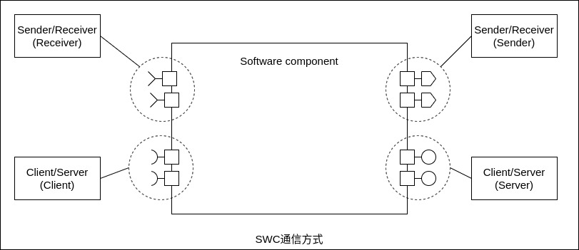

发送端——接收端(Sender/Receiver)用来传输数据，具有一个通信端口可以包含多种数据类型的特点。但如果一个数据类型要通过总线传输，那么它必须与一个信号对应起来，数据类型既可以是简单的数据类型(integer,float)，也可以是复杂类型(array,record)。通信方式是 1:n 或 n:1 。如下图所示。

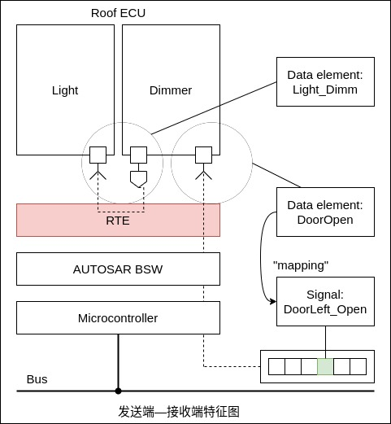

在上面的图示中，当车门打开时，会发送一个信号给调光器。调光器接收到信号后，调用 RTE 接口，调整灯的亮度。

客户端——服务器端口(Client/Server)用来提供 Operation 服务，具有一个客户端——服务器端口可以包含多种 Operation 和同步或异步通信的特点，一个客户端——服务器端口可以包含多种 Operations 操作，Operations 操作也可被单独调用。通信方式是 1:n 或 n:1 。

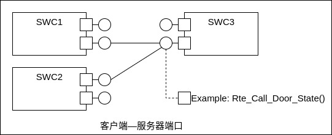

3.可运行实体

可运行实体(Runnable Entities)简称 Runnables，就是 SWC 中的函数，可以是具体的逻辑算法或是实际操作。在 AutoSAR 架构在被 DaVinci 软件生成的时候，Runnable 是空函数，需要手动添加代码来实现其实际的功能。Runnable 可以被触发，比如被定时器触发、被操作调用触发或者被接受数据触发等。如下图所示。

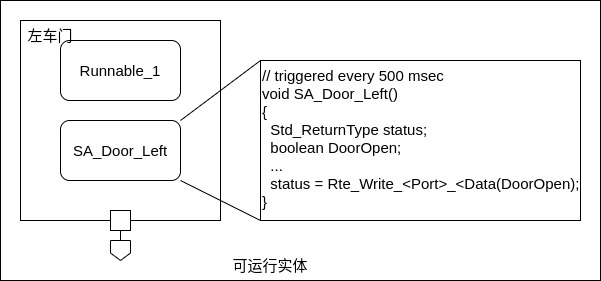

### Runtime Environment(中间件)

中间件(RTE)部分组应用层提供了通信手段，这里的通信是一种广义上的通信，可以理解成接口。应用层与其他软件的信息交互有两种，`第一种是应用层中不同模块之间的信息交互`，`第二种是应用层模块同基础软件之间的信息交互`。如下图所示。

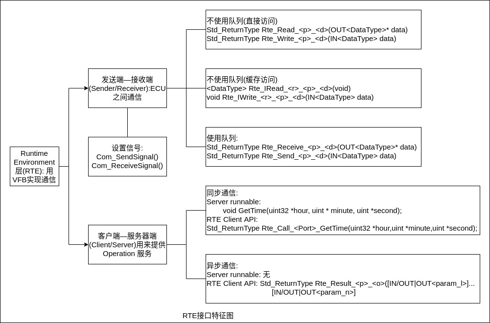

RTE 就是上面这些交互使用的接口的集散地，它汇总了所有需要和软件体外部交互的接口。从某种意义上来看，设计符合 AUTOSAR 规范的系统其实就是设计 RTE 。

SWC 之间的通信是通过调用 RTE API 函数而非直接实现的，均由 RTE 管理和控制。每个 API 遵循统一的命名规则且仅与软件组件自身的描述有关。具体通信实现取决于系统设计和配置，由工具供应商提供的 RTE Generator 自动生成。

在设计开发阶段，软件组件通信层面引入了一个新的概念，虚拟功能总线(Virtual Functional Bus,VFB)。如下图所示。

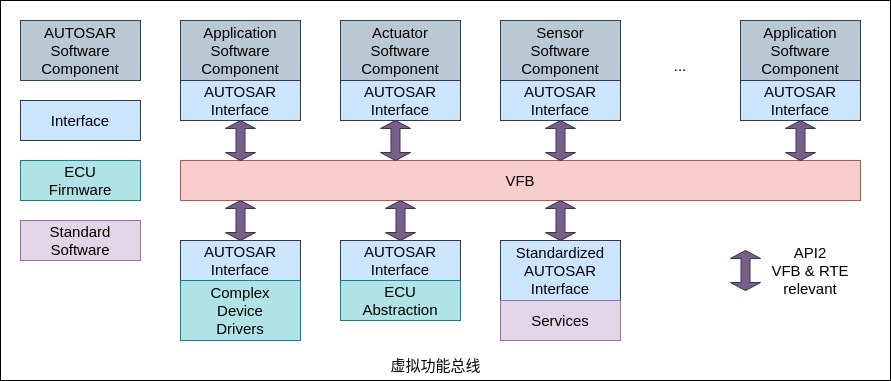

VFB 是对 AUTOSAR 所有通信机制的抽象。利用 VFB，开发者将软件组件的通信细节抽象，只需要通过 AUTOSAR 所定义的接口进行描述，即能够实现软件组件与其他组件以及硬件之间的通信，甚至是 ECU 内部或者是与其他 ECU 之间的数据传输。

RTE 提供了三种接口描述。
- 1.Standardized Interface(标准接口): 标准接口是在 AUTOSAR 规范中被标准化的接口，但并未使用 AUTOSAR 接口技术，标准接口通常被用于某个 ECU 内部的软件模块之间的通信，不能用于网络通信。
- 2.Standardized AUTOSAR Interface(标准AUTOSAR接口): 标准 AUTOSAR 接口是在 AUTOSAR 规范中使用 AUTOSAR 接口技术标准化的接口，这种接口的语法和语义都被规定好了，通常在 AUTOSAR 服务中使用，是基础软件服务提供给应用程序的。
- 3.AUTOSAR Interface(AUTOSAR接口): AUTOSAR 接口定义了软件模块和 BSW 模块(仅仅是 I/O 抽象和复杂驱动)之间交互的方式，AUTOSAR 接口以 Port 的形式出现，将 ECU 内部的通信和网络通信使用的接口进行了统一。

### Basic Software(基础软件)

现代汽车中有多种 ECU,各自具有不同功能，但实现这些功能所需要的基础服务是可以抽象出来的，例如 I/O 操作、AD操作、诊断、CAN通信、操作系统等。差别是，不同的 ECU 功能所操作的 I/O、AD 代表不同的含义，所接收和发送的 CAN 消息具有不同的内容，操作系统调度的任务周期优先级不同。这些可以被抽象出来的基础服务被称为基础软件。根据不同的功能将基础软件可继续细分为 4 部分，分别为服务层(Service Layer)、ECU抽象层(ECU Abstract Layer)、复杂驱动(Complex Drivers)和 MCAL 层(Microcontroller Abstraction Layer)，4 部分之间的互相依赖程度不尽相同。如下图所示。

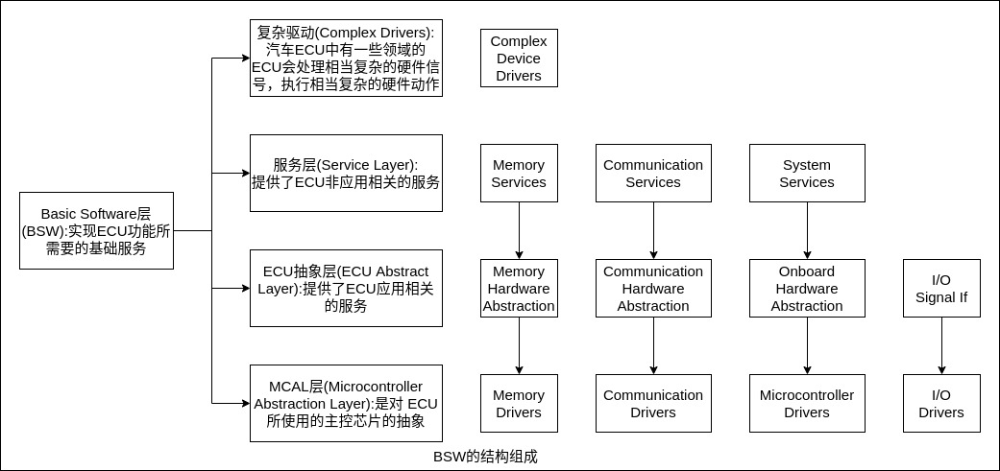

服务层(Service Layer)，这一层基础软件提供了汽车 ECU 非应用相关的服务，包括操作系统(OS)、网络通信、内存管理(NVRAM)、诊断(UDS、故障管理等)、ECU 状态管理模块等，它们对 ECU 的应用层功能提供辅助支持。该层软件在不领域的 ECU 中也非常相似，例如不同的 ECU 中的 OS 的任务周期和优先级不同，不同的 ECU 中的 NVRAM 的分区不同，存储的内容不同。

ECU抽象层(ECU Abstract Layer)，这一层软件提供了 ECU 应用相关的服务，它是对一个 ECU 的抽象，包括 ECU 的所有输入和输出，例如数模转换(AD)、PWM等。该层软件直接实现了 ECU 的应用层功能，可以读取传感器状态，可以控制执行器输出。不同领域的 ECU 会有很大的不同。

MCAL层(Microcontroller Abstraction Layer)，这一层软件是对 ECU 所使用的主控芯片的抽象，它跟芯片的实现紧密相关，是 ECU 软件的最底层部分，直接和主控芯片及外设芯片进行交互。其作用是将芯片提供的功能抽象成接口，再将这些接口提供给服务层或 ECU 抽象层使用。

复杂驱动(Complex Drivers)，现代汽车中有一些领域的 ECU 会处理复杂的硬件信号，执行复杂的硬件动作，例如发动机控制、ABS等。这些功能相关的软件很难抽象出来适用于所有类型 ECU，其与 ECU 应用及 ECU 所使用的硬件紧密相关，属于在 AUTOSAR 架构中无法移植于不同 ECU 的部分。

微控制器抽象层是基础软件中的最底层。它包含各种驱动模块，用来对 uC 内部设备和映射了 uC 外部设备的内存进行访问。

下图为 BSW 层各个子模块示意。

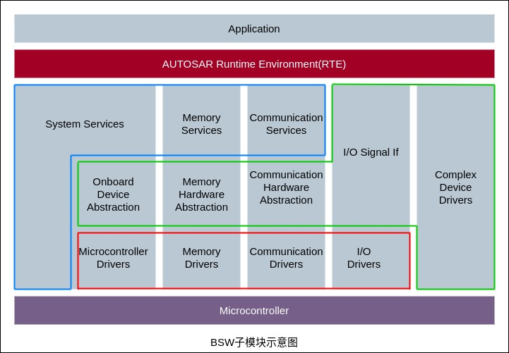

### System Services(系统服务)

系统服务是一组可以由所有层模块调用的模块和功能，例如实时操作系统、错误管理器和库功能，为应用和基本软件模块提供基本服务。具体包括 AUTOSAR OS、BSW 调度器和模式管理器 3 个部分。如下图所示。

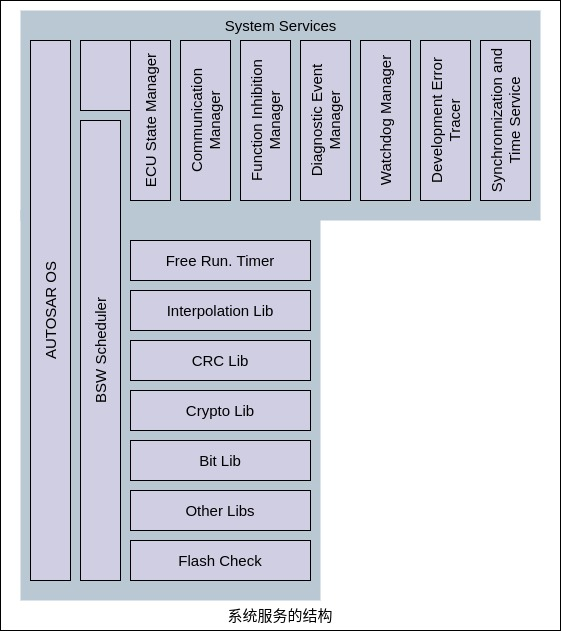

1.AUTOSAR OS

AUTOSAR OS 为实时应用提供了所有基本服务，即中断处理、调度、系统时间和时钟同步、本地消息处理，以及错误检测机制。所有服务都隐藏在良好定义的 API 之后。应用与 OS 和通信层的连接只通过 API。其基本特征包括: 静态配置、能推断实时系统性能和提供基于优先级的调度策略等。

在嵌入式汽车 ECU 中的实时操作系统构成软件动态行为的基础。它管理任务和事件的调度和不同任务间的数据流，并且提供监控和错误处理功能。但是，在汽车系统中，对操作系统的需求集中在特定领域，所使用的操作系统必须高效运行并且所占存储空间小。在多媒体和远程信息处理应用中，操作系统提供的特征集以及可用计算资源有很大不同。在纯粹的任务管理之上，操作系统中还包含了复杂的数据处理(例如流、快速文件系统等)和存储管理甚至图形用户接口。

2.BSW调度器

BSW 调度器是系统服务的一部分，它向所有层的所有模块提供服务。但是，与其他 BSW 模块不同，BSW 调度器提供了集成的概念和服务。BSW 调度器可提供方法把 BSW 模块的实现嵌入 AUTOSAR OS 中，并应用 BSW 模块的数据一致性机制。集成者的任务是应用所给的方法(AUTOSAR OS 提供的)，在特定项目环境中以良好定义和有效的方式把 BSW 模块装配起来。这也意味着 BSW 调度器只是使用 AUTOSAR OS，它与 AUTOSAR OS 调度器并不冲突。

3.模式管理

模式管理包括 3 个基本软件模块: ①ECU状态管理器，控制 AUTOSAR BSW 模块的启动阶段，包括 OS 的启动；②通信管理器，负责网络资源管理；③看门狗管理器，基于应用软件的生存状态触发看门狗。


### RTE 与 runnable 的关系

RTE 提供了 SWC 的运行环境。作用如下:
- 提供跨 ECU/ECU内部 的通信管理。
- 提供对 runnable 的管理功能（触发、唤醒等，简单说就是 runnable 需要映射到 Task 上运行，而这个映射就是通过 RTE 具体实现的）。
- RTE 就是 VFB（虚拟功能总线）的具体实现。

RTE 对 Runnables 的运行支撑包括:
- 通过 RTE 给 runnable 提供触发事件。
- 通过 RTE 给 runnable 提供所需资源。就是接口通信（Ports），将 runnable 需要的一些资源通过接口传输给它。
- 将 BSW 和 SWC 做隔绝。因此 OS 和 runnables 也被隔绝了，runnable 的运行条件由 RTE 提供，不能由 OS 直接提供。

Runnables 的触发条件。RTE 给 runnables 提供触发条件，也就是 runnable 在设计的时候，需要有触发条件进行运行。触发条件就是一些特定的事件，AutoSAR 中主要规定了以下一些触发条件:
- 初始化事件： 初始化自动触发
- 定时器事件： 给一个周期定时器，时间到了就触发
- 接收数据事件（S/R）： Receiver Port 一旦收到数据，就触发
- 接收数据错误事件（S/R）
- 数据发送完成事件（S/R）： Send Port 发送完成，就触发
- 操作调用事件（C/S)： 当调用到了该函数的时候
- 异步服务返回事件（C/S)： C/S 可以在异步下运行，如果以异步方式调用一个 Server 函数，那么该被调用函数会作为一个线程和当前的运行程序并行运行，当被调用函数运行结束返回的时候，这时触发异步服务返回事件。
- 模式切换事件
- 模式切换应答事件

### RTE 对 Ports 的支撑

#### S/R 接口的不同方式

RTE 对 Runnable 的调用方式
- 直接调用
- 缓存调用
- 队列调用

> 跨 ECU 的方式

假如是跨 ECU 的数据传输。那么在 runnable 中使用 `Rte_Wirte_<port>_<Data>()` 这样的函数后，会需要走 runnable(ECU1) -> RTE(ECU1) -> BSW(ECU1) -> 外部总线 -> BSW(ECU2) -> RTE(ECU2) -> runnable(ECU2) 。

这里列出用于 COM 传输的两个函数名:
``` c
  Com_SendSignal()
  Com_ReceiveSignal()
```

#### C/S 接口的不同方式

- 同步调用
- 异步调用
