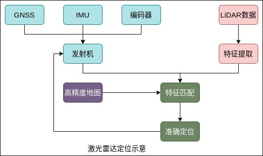
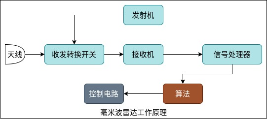

现有的车载传感器主要包括超声波雷达、激光雷达、毫米波雷达、车载摄像头、红外探头等。主流的自动驾驶感知平台`以雷达和车载摄像头为主`，并呈现多传感器融合发展的趋势。

各传感器各有优劣，无法在安装单一传感器的情况下完成对自动驾驶功能性和安全性的全面覆盖。因此，完备的自动驾驶系统应该是各个传感器之间借助各自所长相互融合、功能互补、互为备份、互为辅助。

主流车载传感器性能对比

| 性能          | 激光雷达 | 毫米波雷达 | 摄像头 | GPS/IMU |
|:-------------|:--------|:---------|:------|:--------|
| 远距离测量能力 | 优       | 优       | 优    | 优       |
| 分辨率        | 良       | 优       | 优    | 优      | 
| 低误报率      | 良       | 优       | 一般   | 优      |
| 温度适应性    | 优       | 优       | 优     | 优      |
| 不良天气适应性 | 较差     | 优       | 较差   | 优      |
| 灰尘/潮湿适应性 | 较差    | 优       | 较差   | 较差    |
| 低成本硬件     | 较差    | 优        | 优    | 良      |
| 低成本信号处理  | 较差    | 优       | 较差   | 良      |

### 激光雷达

激光雷达的工作原理是通过首先向目标发射一束激光，然后根据接收——反射的时间间隔确定目标物体的实际距离。同时结合这束激光的发射角度，利用基本的三角函数原理推导出目标的位置信息。

激光雷达可以用于测量物体距离和表面形状，精度可以达到厘米级。由于具有能量密度高、方向性好的特点，探测距离往往能达到 100m 以上。

激光雷达在自动驾驶运用中拥有两个核心作用。
1. 三维建模进行环境感知。通过激光扫描可以得到汽车周围环境的三维模型，运用相关算法比对上一帧和下一帧的变化可以较容易地探测出周围的车辆和行人。
2. SLAM 加强定位。三维激光雷达的另一大特性是同步建图(SLAM)，实时得到全局地图。通过和高精地图中特征物的比对，可以实现导航及加强车辆定位精度等功能。

激光雷达联合 GNSS/IMU 与高精地图等手段进行加强定位时，一方面通过 GNSS 得到初始位置信息，再通过 IMU 和车辆的 Encoder(编码器)配合得到车辆的初始位置；另一方面，将激光雷达的 3D 点云数据，包括几何信息和语义信息进行特征提取，并结合车辆的初始位置进行空间变化，获取基于全局坐标系下的矢量特征。最后，将初始位置信息，激光雷达提取的特征跟高精地图的特征信息进行匹配，从而获取一个准确的定位。如下图所示。

LiDAR 以线数及距离两大因素为标准，价格从几百美元到几万美元不等。单纯激光雷达的应用在国内已相对较广，像扫地机器人使用的便是单纯激光雷达。单纯激光雷达可以获取二维数据，但无法识别目标的高度信息，而多线激光雷达则可以识别 2.5 维甚至是三维数据。目前，在国际市场上推出的主要有 4 线、8 线、16 线、32 线、64 线和 128 线。随着线数的提升，每秒采集的数据点就越多，所要处理的数据量也非常巨大。同时，线数越多也代表着激光雷达的造价越昂贵。

激光雷达想在无人车上普及首先应该降低价格。有两种解决办法: 其一是采用低线数雷达配合其他传感器，但需搭配拥有极高算力系统的无人车；其二是采用固态激光雷达。激光雷达最贵的就是机械旋转部件，固态激光雷达无须旋转部件，采用电子设备替代，体积更小，方便集成，系统可靠性更高，成本也可大幅降低。

在自动驾驶领域，激光雷达是目前最有效的方案，被认为是最精准的自主感知手段，其有效感知范围超过 120m，而精度可以达到厘米级。但由于现阶段价格高昂，无法部署在量产车上，是目前最难以跨越的硬件门槛。多线激光雷达的成本下降将会显著加速自动驾驶汽车的量产。

### 摄像头

车载摄像头的工作原理是: 首先采集图像，将图像转换为二维数据；然后，对采集的图像进行模式识别，通过图像匹配算法识别行驶过程中的车辆、行人、交通标志等；最后，依据目标物体的运动模式或使用双目定位技术，估算目标物体与本车的相对距离和相对速度。

摄像头可以获得最接近人眼获取的周围环境信息，但是也存在缺点。首先，基于视觉的感知技术受光线、天气影响较大，在恶劣天气和类似于隧道内的昏暗环境中其性能难以得到保障；其次，物体识别基于机器学习资料库，需要的训练样本很大，训练周期长，也难以识别非标准障碍物。此外，由于广角摄像头的边缘畸变，得到的距离准确度较低。

从应用方案出发，目前摄像头可划分为单目前视、单目后视、立体(双目)前视和环视摄像头 4 种，如表所示

| 自动驾驶辅助功能 | 使用摄像头 | 具体功能简介 |
|:--------------|:---------|:------------|
| 车道偏离预警 LDW | 前视 | 当前视摄像头检测到车辆即将偏离车道线时，会发出警报 |
| 前向碰撞预警 FCW | 前视 | 当摄像头检测到与前车距离过近，可能发生追尾时，会发出警报 |
| 交通标志识别 TSR | 前视、侧视 | 识别前方道路两侧的交通标志 |
| 交通保持辅助 LKA | 前视 | 当前视摄像头检测到车辆即将偏离车道线时，会向控制中心发出信息，然后由控制中心发出指令，及时纠正行驶方向 |
| 行人碰撞预警 PCW | 前视 | 前摄像头会标记前方道路行人，并在可能发生碰撞时及时发出警报 |
| 盲点监测 BSD | 侧视 | 利用侧视摄像头，将后视镜盲区内的景象显示在驾驶舱内 |
| 全景泊车 SVP | 前视、侧视、后视 | 利用车辆四周摄像头获取的影像，通过图像拼接技术，输出车辆周边的全景图 |
| 泊车辅助 PA | 后视 | 泊车时将车尾的影像显示的驾驶舱内，预测并标记车轨迹，辅助驾驶员泊车 |
| 驾驶员注意力监测 | 内置 | 安装在车内，用于检测驾驶员是否疲劳、闭眼等 |

- 单目前视摄像头一般安装在前挡风玻璃上部，用于探测车辆前方道路，识别道路、车辆、行人等。先通过图像匹配进行目标识别(各种车型、行人、物体等)，再通过测量目标物体在图像中的大小估算目标距离。单目前视视觉方案的技术难点在于机器学习模型的智能程度或者模式识别的精度。
- 单目后视摄像头一般安装在车尾，用于探测车辆后方环境，技术难点在于如何适应各种恶劣环境。
- 立体(双目)前视摄像头通过对两幅图像视差的计算，直接对前方景物(图像所拍摄到的范围)进行距离测量，而无须判断前方出现的是什么类型的障碍物。使用这种方案，需要两个摄像头有较高的同步率和采样率，因此技术难点在于双目标定及双目定位。另外，双目摄像头的测距精度依赖两个摄像头的安装距离，对安装精度和设备刚性也有比较高的要求。
- 环视摄像头一般至少包括 4 个摄像头，分别安装在车辆前、后、左、右侧，实现 360 度环境感知，难点在于畸变还原与对接。

| 安装部位 | 摄像头类型 | 应用场景 |
|:-------|:----------|:--------|
| 前视    | 单目、双目 | FCW、LDW、SR、ACC、PCW |
| 环视    | 广角      | 全景泊车、LDW |
| 后视    | 广角      | 后视泊车辅助 |
| 侧视    | 广角      | 盲点检测、替代后视镜 |
| 内置    | 广角      | 闭眼提醒 |

- 前视摄像头一般采用 55° 左右的镜头以得到较远的有效距离，双目摄像头需要装在两个位置。前视摄像头可以实现车道偏离预警、车辆识别、行人识别、道路标识识别等 ADAS 主动安全的核心功能，未来将成为自动紧急制动(AEB)、自适应巡航(ACC)等主动控制功能的信号入口。
- 环视使用的是广角摄像头，通常在车四周装备 4 个进行图像拼接以实现全景图，通过辅助算法可实现道路感知。
- 后视采用广角或者鱼眼镜头，主要为倒车使用。
- 侧视一般使用两个广角摄像头，完成盲点检测等工作，可代替后视镜。这一功能也可由超声波雷达替代。
- 内置使用的同样是广角镜头，安装在车内后视镜处，完成在行驶过程中对驾驶员的闭眼提醒。

车载摄像头需要具备的首要特性是高速采集图像的能力，特别是在高速行驶场合，系统必须能记录关键驾驶状况、评估这种状况并实时启动相应措施。为避免两次图像信息获取间隔期间自动驾驶的距离过长，要求车载摄像头具有最慢不低于 30f/s 的影像捕捉速率。在功能上，车载摄像头需要在复杂的运动路况环境下保证采集到稳定的数据。具体要求如下:
- 高动态。在较暗环境及明暗差异较大时仍能实现识别，要求摄像头具有高动态的特性。
- 中低像素。为降低计算处理的负担，摄像头的像素并不需要非常高。目前30万~120万像素已经能满足要求。前视摄像头为了实现远距离物体成像需要更高像素，200万~500万甚至更高像素已经成为发展趋势。
- 角度要求。对于环视和后视，一般采用 135° 以上的广角镜头，前置摄像头对视距要求更大，一般采用 55° 的范围。

### 毫米波雷达

毫米波雷达通过发射无线电信号(毫米波波段的电磁波)并接收反射信号来测定汽车车身周围的物理环境信息(如汽车与其他物体之间的相对距离、相对速度、角度等)，感知系统根据所探知的物体信息进行目标追踪和识别分类，进而结合车身动态信息进行数据融合，完成合理决策，降低事故发生概率。

毫米波兼具微波制导和光电制导的优点，可以检测到 30~100m 甚至更远的物体。同时，毫米波雷达不易受天气状况限制，即使是雨雪天也能正常运作，穿透雾、烟、灰尘的能力强；具有全天侯、全天时的工作特性，且探测距离远，探测精度高，被广泛应用于车载距离探测，如自适应巡航、碰撞预警、盲区探测、自动紧急制动等。

在自动驾驶汽车领域，车载毫米波雷达通过天线发射毫米波，接收目标反射信号，经后台处理后快速准确地获取汽车车身周围的物理环境信息(如汽车与其他物体之间的相对距离、相对速度、角度、运动方向等)，然后根据所探知的物体信息进行目标追踪和识别分类，进而结合车身动态信息和其他传感器接收的信息进行数据融合，通过中央处理单元(ECU)进行智能处理，经合理决策后，及时对汽车运动执行控制，从而实现自动驾驶。原理图如下。

相比激光雷达，毫米波雷达精度低、可视范围角度偏小，一般需要多个雷达组合使用。毫米波雷达的主流工作频段为 24GHz 和 77GHz，分别应用于中短距和中长距测量。短距探测精度高，长距侦测范围更广。为完全实现自动驾驶辅助系统的各项功能，一般需要配置`1长+4中短`一共 5 个毫米波雷达。

毫米波雷达的主要问题是存在互相干扰的可能。频率不同的电磁波在传输过程中相互独立，但是频率相近的电磁波却会互相叠加，使信号劣化。调频连续波雷达本身不能免疫干扰。随着道路上装载毫米波雷达的车辆增加，相似频段的雷达信号也随之增加，雷达之间的干扰不可避免。干扰信号可以通过直线传播直接干扰，也可以经过物体反射从而间接干扰。这样的结果是大大降低了信号的信噪比，甚至会导致雷达"致盲"。

### 超声波雷达

超声波雷达是通过发射并接收 40kHz 的超声波，根据时间差算出障碍物距离。其测距精度是1~3cm。常见的超声波雷达有两种: 第一种是安装在汽车前后保险杠上的，用于测量汽车前后障碍物的驻车雷达或倒车雷达，称为超声波驻车辅助传感器(Ultrasonic Parking Assistant,UPA)；第二种是安装在汽车侧面，用于测量侧方障碍物距离的超声波雷达，称为自动泊车辅助传感器(Automatic Parking Assistant,APA)。

超声波雷达具有诸多优点。超声波能量消耗较为缓慢，防水、防尘性能好，传播距离较远，穿透性强，测距方法简单，成本低，且不受光线条件的影响。尤其是短距离测量中，超声波雷达的测距有着非常大的优势。但是，超声波是一种机械波，使得超声波雷达有着根源性的局限性。
- 对温度敏感。波速受温度影响，因此测量的精度也与温度直接相关。传播速度较慢时，若汽车行驶速度较快，使用超声波测距无法跟上汽车车距的实时变化，误差较大。
- 超声波散射角大，方向性较差，无法精确描述障碍物位置。在测量较远距离的目标时，其回波信号较弱。

超声波雷达在自动驾驶汽车上主要用于泊车系统、辅助制动等。通常一套倒车雷达需要安装 4 个 UPA 传感器，而自动泊车系统在倒车雷达的基础上再加 4 个 UPA 传感器和 4 个 APA 传感器。UPA 的探测距离一般在 15~250cm 之间，主要用于测量汽车前后方向的障碍物。APA 的探测距离一般在 30~500cm 之间，探测范围更远，因此相比于 UPA 成本更高，功率也更大。APA 传感器与倒车雷达工作频率不同，不形成干扰。

超声波雷达的基础应用是倒车辅助。在这个过程中，超声波传感器通常需要同控制器和显示器结合使用，从而以声音或者更直观的显示方式告诉驾驶员周围障碍物的情况，解除驾驶员泊车、倒车和启动车辆时前后左右探视引起的困扰，并帮助驾驶员扫除视野死角和视线模糊的缺陷，提高驾驶安全性。除障碍物检测外，超声波雷达还有许多应用场景，例如泊车位检测、高速横向辅助等。
