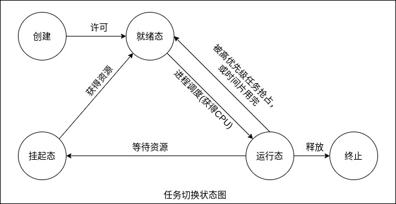

### 定义

实时操作系统是确保在规定时间内完成指定功能的操作系统。实时操作系统可以被划分为硬实时(hard realtime)和软实时(soft realtime)操作系统，划分标准为硬性截止时间的不同。硬实时系统是指要在最坏情况(负载最重)下确保在服务时间内完成响应，即于事件的截止响应期限必须在规定时间内满足(一次也不能超时)。软实时系统是指在规定时间以内，尽量保证处理完成相关任务和数据，当出现了超时情况，也属于可以接受的范围，并不会造成严重的后果(允许有限次数内超时)。

对于在实际应用过程中所出现的相同情况，硬实时系统和软实时系统会采用完全不同的应对策略。如果因为延期导致错过了任务的执行截止时间，硬实时系统会选择直接结束当前工作，然后关闭系统；而软实时系统仅仅放弃执行当前任务，可能会有短暂的暂停，然后转为执行队列中的下一个就绪任务。

### 特征

实时操作系统最显著的特征就是实时性，即当外部数据或者请求到来之时，在极其短暂(微秒级)的时间内做出中断响应，并且交由 CPU 进行处理。另外，高可靠性也是其特征之一，如果有特殊情况发生，它能在某个时间范围内得到处理。

1 高精度计时系统: 计时精度是影响实时性的一个重要因素 。在实时应用系统中，经常需要精确实时地操作某个设备或执行某个任务，或精确地计算一个时间函数。这些不仅依赖一些硬件提供的时钟精度，也依赖实时操作系统实现的高精度计时功能。

2 多级中断机制: 一个实时操作系统通常需要处理多种外部信息或事件，但处理的紧迫程度有轻重缓急之分。有的必须立即做出反应，有的则可以延后处理。因此，需要建立多级中断嵌套处理机制，以确保对紧迫程度较高的实时事件及时进行响应和处理。

3 实时调度机制: 实时操作系统不仅要及时响应事件中断，同时也要及时调度运行实时任务。但是处理机调度并不能随心所欲地进行，因为涉及两个进程之间的切换，只能在确保"安全切换"的时间点上进行。实时调度机制包括两个方面: 一是在调度策略和算法上保证优先调度实时任务；二是建立更多"安全切换"时间点，保证及时调度实时任务。

### 基本概念

代码临界段: 在一个时间段内，只允许一个线程或进程进行独占式访问的代码段。其他所有试图访问该代码段的进程都必须进行等待。

资源: 进程所占用的任何实体。

共享资源: 可以被多个进程共享的一次具体活动，以进程或者线程的方式存在，拥有自己的地址空间(包括文本、数据和堆栈共同使用的实体)。

任务切换: 当系统中存在两个或两个以上的任务时，处于就绪态任务需要抢占运行态任务，或者运行态任务执行完毕，需要让出 CPU 控制权而进行的切换操作；当前占据 CPU 使用权的任务存入栈区，将下一个即将开始的任务装入 CPU 寄存器，开始运行。

内核: 操作系统的核心，是硬件层和软件层的交互媒介，提供操作系统的基本功能。负责对任务的管理、CPU 调度、设备驱动、内存管理等，可以分为抢占式和非抢占式。

调度: 当多个进程向同一资源发出请求时，由于访问互斥性，必须按照一定优先次序对唯一性资源进行分配。

### 关于优先级的问题

任务优先级根据运行过程中是否恒定，分为静态优先级和动态优先级。在实际应用过程中，经常会遇到优先级翻转的问题，导致优先级较低的进程长时间占据共享资源，阻塞了高优先级任务的运行。目前，有"优先级天花板"和"优先级继承"两种办法可以解决这个问题。

第一种方法是在所有申请同一共享资源的任务中选出一个最高优先级，把这个优先级赋给每一个申请该资源的任务，即不让某一资源的优先级成为影响高优先级的任务运行的关键因素。第二种方法是当出现高优先级任务被低优先级任务占用临界区资源时，在一定时间内将低优先级任务提高到与高优先级任务相同，缺点是每一项新任务到来时，都需要进行判断。

### 互斥

共享内存的意义在于可以让进程之间的通信变得方便、迅速，但是当一个进程对该区域进行读写的时候，为了防止脏读脏写，必须保证访问的互斥性，即其余请求访问该内存区域的进程必须等待，直到此内存块被释放。

实现互斥访问一般包括软件和硬件两种方法，软件方法比较著名的有 DEKKER 算法和 PETERSON 算法(更好)；硬件方法主要是通过特殊指令来达到保护临界区的目的，包括忙等待、自旋锁、开关中断指令、测试并加锁指令、交换指令等。

### 任务切换时间

任务切换的时间是衡量一个实时操作系统实时性能的重要指标之一，其取决于 CPU 需要等待入栈的寄存器个数。CPU 寄存器个数越多，则切换时间越长。

任务切换时的状态如下图所示。

### 中断响应时间(可屏蔽中断)

中断响应时间是另一个衡量实时操作系统实时性能的重要指标，其主要由关中断的最长时间、保护 CPU 内部寄存器的时间、进入中断服务函数的执行时间、开始执行中断服务程序(ISR)的第一条指令时间构成。
