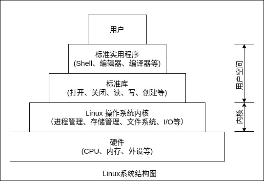

### 定义

准实时操作系统是使一台计算机采用时间片轮转的方式同时为几个、几十个甚至几百个用户服务的一种操作系统。为把计算机与许多终端用户连接起来，准实时操作系统将系统处理机时间与内存空间按一定的时间间隔，轮流地切换给各终端用户的程序使用。由于时间间隔很短，每个用户的感觉就像他在独占计算机一样。`准实时操作系统的特点是可有效地增加资源的使用率。`

准实时操作系统典型的例子就是 UNIX 和 Linux 操作系统。其可以同时连接多个终端并且每隔一段时间重新扫描进程，重新分配进程的优先级，动态分配系统资源。

### 特征

1 交互性(同时性): 用户与系统进行人机对话。

2 多路性(多用户实时性): 多用户同时在各自终端上使用同一 CPU 和其他资源，充分发挥系统的效率。

3 独立性: 用户可彼此独立操作，互不干扰，互不混淆。

4 及时性: 用户在短时间内可得到系统的及时回答。

影响响应时间的因素主要有终端数目多少、时间片的大小、信息交换量、信息交换速度等。

### Linux 系统结构

Linux 系统是一个分层的体系结构，位于硬件层之上，由用户空间和内核空间组成，其中高位的物理内存由内核空间占用，这部分内存只限运行在内核态的进程访问；低位的物理内存由用户空间使用。

进程对用户空间的访问是互相隔离的，进程不能访问其他进程的用户空间。某一时刻占据 CPU 的进程，拥有自己的虚拟内存空间。

所有实时应用，都需要在极短的反应时间内，满足系统的任务处理需求。目前版本的 Linux 系统由于以下几个自带特性，是无法满足硬实时操作系统要求的:
- 时间粒度太大(毫秒级)
- 时间片轮转调度策略
- 虚拟内存管理、
- 非抢占式内核
- 临界区中断屏蔽

Linux 进程的运行状态一般分为`阻塞态、就绪态和运行态` 3 种。当一个进程所有资源都具备，只差 CPU 控制权的时候，会根据优先级被插入就绪队列合适位置，进入就绪态。当就绪队列的进程获得 CPU 之后，进入运行态，直至时间片用完，进入新的就绪队列；或者 I/O 设备等硬件资源被剥夺，则进入阻塞态，直到重新获取硬件资源，再由系统移至就绪队列末尾继续等待。`在 Linux 系统中，一旦进程进入运行状态，即便就绪队列中有更高优先级任务到达，也无法立即对运行中的低优先级进程进行抢占。除非当前运行的低优先级进程自动放弃 CPU 控制权，或者等待硬件资源被剥夺而造成阻塞，否则将一直处于运行态。`这个时间间隔甚至可能达到毫秒级别，这对于实时性要求很高的系统是完全无法容忍的。此外，`当 Linux 系统在对临界区资源进行操作时，中断标志位是处于屏蔽状态，即无法通过中断请求，而立刻插入执行高实时性任务。`等待的时间长度完全取决于系统调用耗费的时间，这段时间内系统无法处理外部的中断请求。实时操作系统要求，对于低优先级的当前运行任务，只要就绪队列中存在优先级比它高的任务，就可以立刻剥夺它的运行权利。

Linux 采用`时间片轮转调度策略，每个进程都被分配相同长度的时间片`，从获取 CPU 运行权开始计时，当期时间片用完之时，不管进程是否运行完毕，都必须交出 CPU 控制权。此调度策略的优点是每一个等待队列中的进程在一定时间内都有机会获得执行权力，防止出现某一进程因等待时间过长而挂死的情况；缺点是对于优先级较高的长进程，可能需要多次调度执行，才能完成任务，降低了系统的平均执行效率。Linux 采取将任务集中进行分配处理的方式，这会导致任务超时未被处理的情况出现。`在用户态下运行的进程，随着时间片用完或者缺少相关硬件资源造成的等待，会被内核剥夺处理器的运行权；而一旦将运行状态切换到内核态，则可以不受限制地一直运行下去，直到自己主动提出放弃请求，或者切回用户态。`当系统出现不可预知情况时，优先级是可以通过系统管理者进行手动修改的。这样做有利于增强复杂环境的适应性，但是也会对程序调度的既定性造成影响。

当出现随机存储器(RAM)不够用的时候，Linux 采用虚拟内存技术，通过将内存映射到扩展的虚拟存储器(外部磁盘)，达到加大内存容量的效果。`首先，这需要建立一个额外的数据结构来管理这部分虚拟内存；其次，缺页所造成的页面换进换出和磁盘 I/O 操作需要一笔不小的时间开支`，并且这段时间支出是无法预知的。如果这段时间里，有高优先级任务到来，系统是无法提供及时响应的。这也是 Linux 无法直接作为实时操作系统的一个重要原因。
