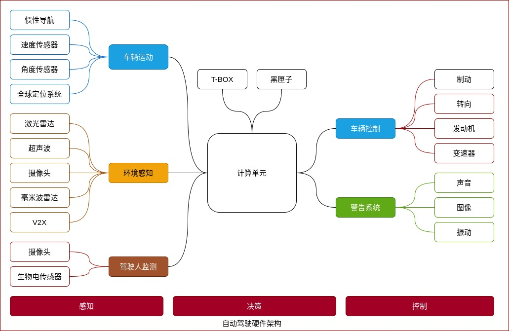
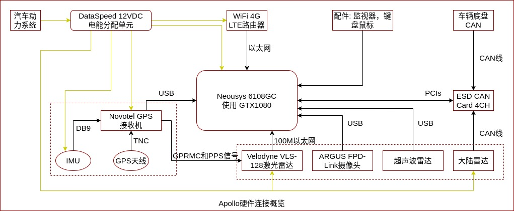
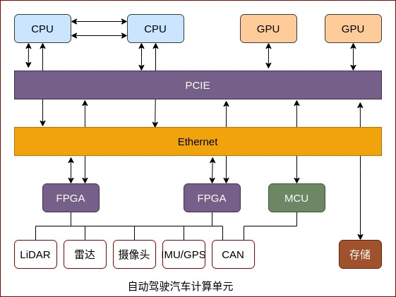
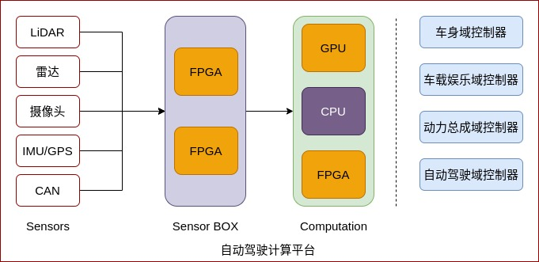

自动驾驶的硬件系统，可以粗略地分为感知、决策、控制 3 部分(还有定位、地图、预测等模块)。自动驾驶不能仅仅考虑系统，还要考虑到人的因素。

自动驾驶硬件架构如下图所示。

以 Apollo 为例，其硬件连接概览图如下所示。

从车辆运动方面考虑，车速、转角以及横滚、俯仰、航向是需要收集的车体自身信息。外部环境感知信息，主要由传感器平台，例如激光雷达、超声波、摄像头、毫米波雷达、V2X 设备采集。V2X 设备可提供超视距功能——当车辆在路上行驶，较难发现超出传感器范围的信息，但 V2X 设备会发送和接收路侧及其他车辆传来的信息，以及前方交通状况。

目前，L3+级自动驾驶的计算单元主要是 CPU+GPU+FPGA 的架构。T-BOX 向上连接互联网，向下连接 CAN 总线。Black Box 负责记录控制指令和车辆行驶状态，事故发生以后可用 Black Box 记录的信息来进行事故的认定。车辆控制主要基于线控系统，包括线控转向、线控节气门、线控制动、线控悬架、线控换挡和线控增压等。

自动驾驶使用的感知类的传感器，主要有激光雷达、毫米波雷达、摄像头以及组合导航。

### 自动驾驶感知传感器

激光雷达安装在车顶，随车运行的同时进行 360° 同轴旋转，可提供周围环境的点云信息。激光雷达不仅用于车辆感知，也用于定位和高精地图的测绘。

摄像头光线通过镜头、滤光片到后段的 CMOS 或 CCD 集成电路，将光信号转换成电信号，再经过图像处理器(ISP)转换成标准的 RAW、RGB 或 YUV 等格式的数字图像信号，再通过数据传输接口传输到计算单元。

毫米波雷达和激光雷达有点类似，基本原理是发射一束电磁波，通过观察回波和射入波的差异来计算距离和速度，主要分 24G 和 77G，它安装在保险杠上面。

组合导航是两部分，一部分是 GNSS 板卡，通过天线接收 GPS 和 RTK 信号，解析计算出自身的空间位置。但是当车辆行驶到林荫路，或者是有些建筑物遮挡时，GPS 就会没信号或者产生多径效应，定位就会产生偏移和不准。此时需要通过 INS 的信息融合来进行组合运算。GNSS+INS 融合在一起就是组合导航系统。

### 自动驾驶计算单元

自动驾驶汽车计算单元如下图所示。

自动驾驶汽车计算单元，必须考虑到冗余设计。所有的 CPU、GPU、FPGA 都是双冗余备份，包括总线也是双冗余备份。在检测系统失效的情况下，MCU 依然能继续正常工作，它发出控制指令给制动系统，让车辆刹停下来，保证安全性，这是系统最后的一道防线。

这种中央集中式的计算也有缺点——整个单元体积比较大，功耗也比较高。在自动驾驶车辆的后备箱内置一个高性能服务器，这显然不利于量产。未来产业化目标是逐步拆分计算量至边缘计算。例如，激光雷达、毫米波雷达、摄像头都接入一个 Sensor BOX，将对准融合后的数据再传输到计算单元进行处理。从整个自动驾驶汽车来看，会根据不同的功能设计不同的域控制器，例如车身域控制器、车载娱乐域控制器、动力总成域控制器、自动驾驶域控制器，彼此之间相互隔离，互不干扰。如下图所示。

传感器单元，即 Sensor BOX，是将所有的传感器数据都统一传输到传感器单元中，`完成时间戳同步`后传输到后端的计算单元进行处理。
