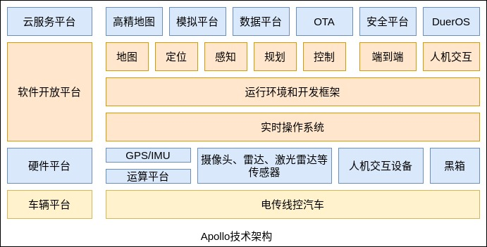

汽车开发平台技术框架主要由 4 层构成。以 Apollo 为例，其框架如下图所示。

云服务平台(Cloud Service Platform): 包括高精地图、模拟平台、数据平台、OTA 模块、安全平台和 DuerOS 。

软件开放平台(Open Software Platform): 包括实时操作系统、承载所有模块的框架层、高精地图与定位模块、感知模块、决策规划模块、控制模块。

硬件平台(Reference Hardware Platform): 包括计算单元、GPS/IMU、Camera、激光雷达、毫米波雷达、人机交互设备、BlackBox 等硬件。

车辆平台(Reference Vehicle Platform): 指一辆能够接受电子信号控制的车辆，也称线控车辆。

