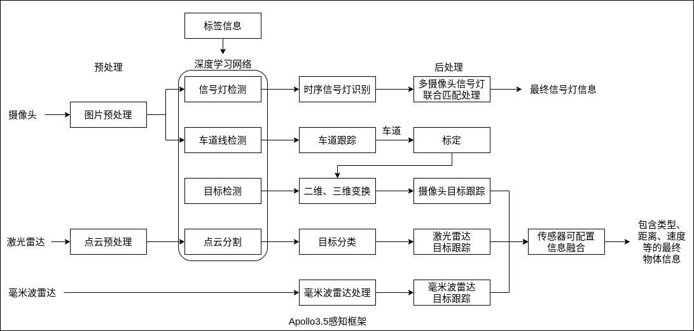

### 地图引擎

地图引擎(Map Engine)是车载终端的高精地图数据管理服务，它封装了地图数据的组织管理机制，屏蔽底层数据细节，对应用层模块提供统一数据查询接口。它包含元素检索、空间检索、格式匹配、缓存管理等核心能力，并提供了模块化、层次化、可高度定制化、灵活高效的编程接口，用户可以基于此轻松构建专属的高精地图解决方案。

### 高精地图

与普通地图不同，高精地图主要服务于自动驾驶车辆，通过一套独特的导航体系，帮助自动驾驶解决系统性能问题，扩展传感器检测边界。目前高精地图可以应用在高精定位、环境感知、决策规划、仿真运行 4 大场景，帮助解决林荫道路 GNSS 信号弱、红绿灯的定位与感知以及十字路口等复杂导航难题。

### 感知平台

以 Apollo 为例，其感知平台(Perception)包括线上感知模块和线下标定服务平台。线上感知模块提供基于深度学习的点动态障碍物的检测、分割和基于运动的跟踪。线下标定服务平台提供云端的跨平台标定服务。

1 线上感知模块

感知模块主要包括`障碍特检测识别`和`红绿灯检测识别`两部分。障碍物检测识别模块通过输入激光雷达点云数据和毫米波雷达数据，输出基于两种传感器的障碍物融合结果，包括障碍物的位置、形状、类别、速度、朝向等信息。红绿灯检测识别模块通过`输入两种焦距下的相机图像数据`，输出红绿灯的位置颜色状态等信息。上述两大感知功能，使无人车具备在简单城市道路自动驾驶的能力。

感知核心模块主要有以下内容。
- 障碍物检测识别: 障碍物模块包括基于激光雷达点云数据的障碍物检测识别、基于毫米波雷达数据的障碍物检测识别以及基于两种传感器的障碍物结果融合算法。基于激光雷达点云数据的障碍物检测识别，通过线下训练的卷积神经网络模型，学习点云特征并预测障碍物的相关属性(例如前景物体概率、相对于物体中心的偏移量、物体高度等)，并根据这些属性进行障碍物分割。基于毫米波雷达数据的障碍物检测识别，主要用来对毫米波雷达原始数据进行处理而得到障碍物结果。该算法主要进行了 ID 扩展、噪点云除、检测结果构建以及 ROI 过滤。多传感器障碍物结果融合算法，用于将上述两种传感器的障碍物结果进行有效融合。该算法主要进行了单传感器结果和融合结果的管理、匹配以及基于卡尔曼滤波的障碍物速度融合。
- 红绿灯检测识别: 红绿灯模块根据自身的位置查找地图，可以获得前方红绿灯的坐标位置。通过标定参数，可以将红绿灯从世界系投影到图像坐标系，从而完成相机的自适应选择切换。选定相机后，在投影区域外选取一个较大的感兴趣区域，在其中运行红绿灯检测来获得精确的红绿灯框位置，并根据此红绿灯框的位置进行红绿灯的颜色识别，得到红绿灯当前的状态。得到单帧的红绿灯状态后，通过时序的滤波矫正算法进一步确认红绿灯的最终状态。所提出的基于 CNN 的红绿灯的检测和识别算法具有极高的召回率和准确率，可以支持白天和夜晚的红绿灯检测识别。

Apollo3.5 的感知框架如下图所示。

2 线下标定平台

自动驾驶传感器标定(Calibration)是指利用传感器采集的数据计算各传感器的内参数(Intrinsic Parameters)以及多个传感器之间外参数(Extrinsic Parameters)的过程。传感器内外参数的标定是各类多传感器融合算法的第一步。

在自动驾驶领域中，多线激光雷达与组合惯导是高精地图制作、激光点云定位以及点云物体检测任务中常用的传感器配置，因此精确标定两者之间的外参数具有非常重要的意义。除此以外，自动驾驶系统使用多传感器融合策略来提高感知性能。因此，相机与毫米波雷达的外参标定也至关重要。

### 规划模块

基于前述几个模块以及导航(Routing)模块、预测(Predication)模块，就可以简单地规划一条有效的路径来自动驾驶。规划模块(Planning)首先需要车辆对路况有基本的判断，前方是否可以停车、跟随、超车，侧方是否绕道等，从而确保车辆能够实现安全而高效的决策行驶。

规划模块可以分为两个部分: 一部分负责对数据的监听、获取和预处理；另一部分负责管理各个优化模块。数据进入规划模块后，对其综合处理为规划模块的内部数据结构，由任务管理器调度合适的优化器进行各个优化任务。综合优化的结果经过最终的验证后，输出给控制模块。在设计上，规划模块实现了策略的可插拔，便得各个优化器可以灵活配置不同策略，提升迭代效率。

### 车辆控制

车辆控制(Vehicle Control)将 GPS 和 IMU 提供的信息作为输入，处理后生成规划信息(包括路径和速度信息)，提供给控制模块使用，然后来实现车辆控制。

对车辆转向及速度进行控制首先需要车辆动力学参数: 制动信号、速度表、节气门、加速度表。当车辆有了控制信号之后，通过 CAN Bus 通信协议中的 DBC file 可以将信号传递给车辆的线控系统，实现节气门、方向盘、换挡、转向灯等控制。
- 纵向控制: 纵向控制主要为速度控制，通过控制制动、节气门、挡位等实现对车速的控制，对于自动挡车辆来说，控制对象其实就是制动和节气门。
- 横向控制: 横向控制主要是控制航向，通过改变方向盘转矩或角度的大小等，使车辆按照设想的方向行驶。

### 端到端解决方案

端到端自动驾驶解决方案因成本低、工程复杂度低等优势正在被不断地探索。通过使用地图采集车采集的大量真实道路数据，完全基于深度学习构造横向和纵向驾驶模型，快速地在真车上进行了实践。
